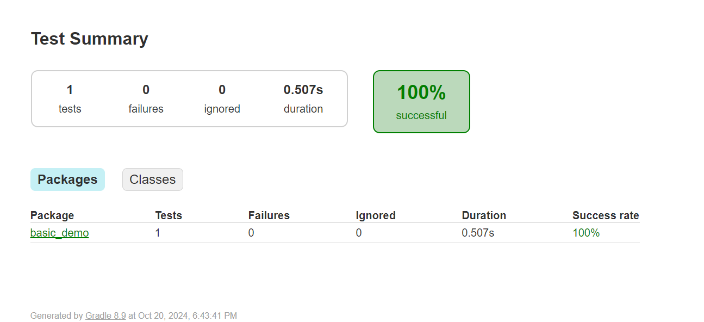
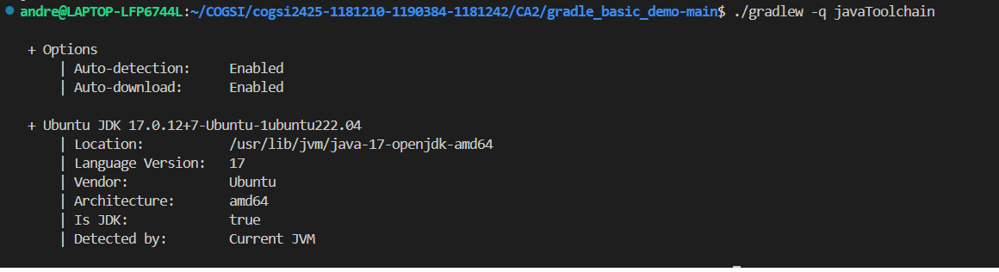
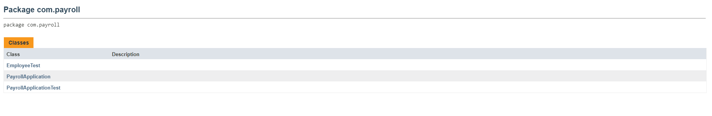

# Este documento visa detalhar os passos seguidos para desenvolver o CA2

## CA2 - Parte 1

### Implementação de projeto JAVA utilizando Gradle

Inicialmente começamos por inicializar um repositório utilizando os conteúdos do repositório https://github.com/lmpnogueira/gradle_basic_demo como uma base inicial.

Os conteúdos do projeto permitem a utilização de uma aplicação de Chat, e permitem a inicialização desta mesma como servidor do serviço ou cliente que se conecta ao servidor.

### Execução do Gradle Wrapper na solução

Devido à existência de um Gradle Wrapper no projeto fornecido, é possível utilizar as capacidades da versão do Gradle associado a este wrapper no projeto.

De forma a executar uma *task* corremos o seguinte comando:

```./gradlew [taskName]```

- Qualquer referência a uma execução de uma task de Gradle neste relatório será em referência a uma execução deste comando do Gradle Wrapper, a não ser que seja explicitamente mencionado.

Inicialmente a única task que temos é a *task* runClient, que abre uma interface visual conectada ao servidor localizado na porta introduzida como argumento:

```./gradlew runClient```

### Criação de tarefa runServer

A tarefa *runClient* é apenas uma parte do puzzle, pois devido a obter uma aplicação de chat funcional é necessário um servidor funcional também, para servir de *host*.
O projeto exemplo contém tudo o necessário para o funcionamento deste *server*, faltando apenas a task para o executar.

A implementação desta task é a seguinte, com comentários a explicar cada passo.

```
task runServer(type:JavaExec, dependsOn: classes){
    group = "DevOps" // O grupo associado à task, o mesmo da task runServer
    description = "Launches a chat server on localhost:59001 " // A descrição da task
  
    classpath = sourceSets.main.runtimeClasspath // O path utilizado para a solução a ser executada, que neste caso é o caminho default para a solução, que normalmente é src/main/java.

    mainClass = 'basic_demo.ChatServerApp' // A classe main a ser executada, neste caso a classe localizada no package basic_demo, entitulada de ChatServerApp

    args '59001' // O argumento enviado para a classe main acima referida, sendo no caso desta implementação o porto a ser utilizado para correr o servidor
}
```

### Criação de unit test em gradle

De forma a testar a capacidade de enviar mensagens na aplicação de chat, foi feito um simples teste que valida a capacidade de inserir uma mensagem na caixa de texto e realizar o seu envio.
Para o teste se tornar devidamente configurado e executável, é necessário adicionar as correspondentes dependências ao build.gradle, que neste caso foram utilizadas as dependências de *"JUnit 5"*.


```dependencies {
    // Testing dependencies
    testImplementation 'org.junit.jupiter:junit-jupiter:5.8.1' // JUnit 5
}
```

A task 'test', task *OOTB* do Gradle, necessita de ser modificada para ter em conta quais as plataformas de teste utilizar na sua execução.

```test {
    useJUnitPlatform() // To use JUnit 5
}
```

Finalmente, para executar os testes apenas é necessário executar a task *`test`*, que irá executar todos os testes declarados na solução, neste caso no *path* "src/test/java", pois é o caminho definido por defeito. Os resultados dos testes são depois aglomerados e inseridos em um relatório de testes na pasta "build/reports/tests/test"



### Tasks para copiar e juntar num ficheiro zip o código fonte

A criação de *tasks* para copiar ou realizar um ficheiro .zip do código seguem ambos um princípio semelhante, a utilização de um *Type* de task.
Ao declarar uma *task* como sendo de um dado tipo, estamos a fazer com que essa *task* execute uma funcionalidade pré implementada além do código executado.

No caso de ambas as tasks criadas nesta secção, o código realizado nestas é apenas utilizado para configurar a funcionalidade do *type* definido, ou seja, os paths de fonte e destino para os ficheiros, como também o tipo de ficheiro afetados pela *Copy*/*Zip*.

```
task backupSources(type: Copy) { // Utiliza o type Copy
    description = 'Copia os ficheiros da pasta src para uma nova pasta backup'

    // Diretório de origem (src) e diretório de destino (backup)
    from  project.ext.srcLocation
    into project.ext.backupLocation
    
    // Informa ao Gradle para incluir tudo na pasta src
    include '**/*'
}
```

Para realizar o arquivo zip do código do backup é necessário este mesmo backup existir primeiro, portanto a task `zipClasses` tem a particularidade de usar o método `dependsOn` para explicitamente declarar a necessidade de ser executada com a condição da task `backupSources` ter sido executada previamente. No momento de execução da task usando o gradle wrapper, o sistema irá sempre executar a tarefa `backupSources` antes de `zipClasses` no caso de ambas foram executadas no mesmo comando. Se apenas a task `zipClasses` for executada, o sistema irá causar a execução task `backupSources` no background, para poder cumprir a dependência.

```
task zipClasses(type: Zip, dependsOn: backupSources){ // Utiliza o type zip, como também depende da execução prévia da task backupSources
    from(project.ext.backupLocation) {
        include '**/*'
    }
    archiveBaseName = project.name
    archiveExtension = 'zip'
}
```

Como valores para os caminhos de fonte e destino foram declaradas variáveis globais no ficheiro build.gradle, para manter consistência entre as várias tasks escritas, utilizando a propriedade `ext`.

```
ext {
    srcLocation = 'src'
    backupLocation = 'backup'
}
```

### Java Toolchain
Explicação do comportamento do toolchain:

Na prática de desenvolvimento moderna, especialmente com o Gradle, não é necessário fazer o download e a instalação manual de versões específicas do Gradle e do JDK porque:

Gradle Wrapper: Muitos projetos utilizam o Gradle Wrapper (gradlew), que permite executar uma build do Gradle sem que o Gradle esteja instalado no sistema. O wrapper faz o download da versão correta do Gradle especificada no projeto quando executamos o comando do wrapper (por exemplo, ./gradlew build). Isso garante consistência entre diferentes ambientes e evita problemas de compatibilidade.

Java Toolchain: O Gradle pode gerir as versões do Java Development Kit (JDK) usando o recurso de Java Toolchain. Isso significa que o Gradle pode automaticamente baixar e usar a versão do JDK necessária, conforme especificado na configuração do build, no nosso caso versão 17, eliminando a necessidade de instalação manual.

Ao executar o comando "gradle -q javaToolchain", o output mostra o toolchain configurado, indicando a versão do JDK usada pelo Gradle, como é possível ver na imagem seguinte.



## CA2 - Parte 2

### Inicialização de projeto Java usando Gradle

Numa pasta vazia, realizar o seguinte comando:
```gradle init```

Este comando irá pedir um conjunto de configurações para a inicialização do projeto.
Estas são as configurações e as seleções utilizadas para este projeto:

- O tipo de build: Application
- A linguagem de implementação: Java
- A versão *target* da linguagem (Java): 17
- O nome do projeto: "tut-restProj"
- A estrutura da aplicação: Single application project
- A linguagem de scripting para a build: Groovy
- A *framework* de testes: JUnit Jupiter

Após a seleção das configurações o Gradle irá criar toda a estrutura de diretórios e ficheiros para a execução da solução.

### Configuração do projeto tutRest em Gradle

Após a configuração de um novo projeto, os módulos do projeto tutRest, desenvolvido na CA1, foram adicionados. 
- Para este relatório, apenas o módulo nonRest será configurado.

O ficheiro build.gradle, foi adicionado ao módulo `nonRest`, e as dependências e plugins necessáriaós para a springFramework e h2Database foram adicionadas ao ficheiro

```
plugins {
    id 'org.springframework.boot' version '3.1.0'
    id 'io.spring.dependency-management' version '1.1.0'
}

dependencies {
    // Spring Boot Starters
    implementation 'org.springframework.boot:spring-boot-starter-web'
    implementation 'org.springframework.boot:spring-boot-starter-data-jpa'

    // H2 database for runtime
    runtimeOnly 'com.h2database:h2'
}
```

Após a configuração é utilizada a *task* `bootRun` para executar a aplicação.

### Criação de task para fazer zip do código fonte

Para a realização de um zip com todo o código fonte, semelhante às tasks anteriores, é realizada uma task do *type* `Zip` de forma a realizar um zip de todos os ficheiros localizados na propriedade ext.srcLocation para o diretório "zipBackups"s na raiz do projeto.

```
task zipSource(type: Zip){
    from(project.ext.srcLocation) {
        include '**/*'
    }
    destinationDirectory = file("zipBackups")
    archiveBaseName = project.name
    archiveExtension = 'zip'
}
```

### Criação para correr a distribuição da solução
Para realizar a task para executar a distribuição da solução foi necessário criar uma task do tipo Exec, de forma a podermos executar comandos da command line, e que depende da task `installDist` para certificar a existência de uma distribuição na sua pasta.
Aqui está a sua implementação:

```
task runInstallation(type: Exec, dependsOn: installDist){
    workingDir file("$buildDir/install/nonrest/bin") // Para garantir que a execução do script é localizado na pasta bin da instalação do módulo nonrest
    // Nos sistemas windows deve ser utilizado o script .bat, portanto é utilizada esta verificação de sistema operativo.
    if (System.properties['os.name'].toLowerCase().contains('windows')) { 
        commandLine 'cmd', '/c', 'nonrest.bat'
    } else {
        commandLine './nonrest'
    }
}
```

### Geração de JavaDoc e o seu packaging para um zip

Para gerar javadoc é configurada a task javadoc OOTB do Gradle, de forma a reconhecer quais caminhos a gerar documentação, as opções de formatação de texto, etc.:

```
javadoc {
    title = 'Javadoc'
    destinationDir = file("${buildDir}/docs") // O Path por onde a documentação será inserida
    source = fileTree(dir: 'src', include: '*/.java') // A source para qual a JavaDoc será gerada
    classpath = sourceSets.main.compileClasspath + sourceSets.test.compileClasspath + sourceSets.integrationTest.compileClasspath /// Todas as classes por qual docs serão gerados
    options {
        encoding = 'UTF-8'
        charSet = 'UTF-8'
        author = true
        version = true
        windowTitle = 'My Javadoc'
    }
}
```

De seguida, a task javadocZip foi criada, dependendo da task javadoc, que através do javadoc gerado na pasta de destino definida é criado um ficheiro .zip no path de destino.

´´´
task javadocZip(type: Zip) {
    dependsOn javadoc // depende da tarefa javadoc
    from javadoc.destinationDir // inclui os ficheiros gerados pela tarefa javadoc
    archiveFileName = "javadoc-${version}.zip" // nome do ficheiro zip
    destinationDirectory = file("${buildDir}/docs") // diretório de destino
}
´´´

### Criação de IntegrationTests num novo Source Set

Para a criação de um novo source set é necessário criar um novo *path* no módulo do projeto, `src/integrationTest/java`.
De forma ao projeto reconhecer este caminho como um Source Set válido é necessário adicionar à task OOTB sourceSets as configurações desejadas, como aqui é representado:


```sourceSets {
    integrationTest { // O nome do novo sourceSet
        java {
            srcDir 'src/integrationTest/java' //O Path a declarar como sourceSet
        }
        // Permitir acesso ao output do módulo main, de forma a testar a integração
        compileClasspath += sourceSets.main.output
        runtimeClasspath += sourceSets.main.output
    }
}
```

Para o funcionamento dos Integration Tests as seguintes dependências e configurações foram adicionadas:

```
dependencies {
    integrationTestImplementation 'io.rest-assured:rest-assured:5.3.0' // Para testar pedidos rest
    integrationTestImplementation 'org.springframework.boot:spring-boot-starter-test' // Para testar aplicações spring
}

configurations {
    // De forma à implementação de testes de integração ter a funcionalidade da classe de testes unitários
    integrationTestImplementation.extendsFrom testImplementation
    integrationTestRuntimeOnly.extendsFrom testRuntimeOnly
}
```

Após a criação da classe de testes no path referido, foi criada a task integrationTest para executar apenas os testes de integração no novo *Source Set*, utilizando o *type* `test`.

```
task integrationTest(type: Test, shouldRunAfter: test) {
    testClassesDirs = sourceSets.integrationTest.output.classesDirs
    classpath = sourceSets.integrationTest.runtimeClasspath

    useJUnitPlatform()  // Ensure JUnit5 is used for integration tests
}
```

Finalmente, para executar os testes de integração apenas é necessário executar a task *`IntegrationTest`*. Os resultados dos testes são depois aglomerados e inseridos em um relatório de testes na pasta "build/reports/tests/integrationTest".

## Solução alternativa ao Gradle para Build Tools

Nesta secção é detalhada uma solução alternativa à utilizada nesta iteração, o Gradle. 

### Introdução

Foi realizada uma pesquisa de outros build tools, neste caso para Java. Foram encontrados diversos build tools, tais como: o Ant, o Bazel, o Buildr, entre outros. 

O build tool selecionado foi o **Bazel**, as razões desta escolha são evidenciadas mais abaixo no documento.

O Bazel é uma ferramenta de build e teste (de código aberto) desenvolvida pelo Google e relativamente semelhante ao Maven e ao Gradle.

O Bazel tem várias vantagens. De seguida são detalhadas algumas delas:

- **Multi-Plataformas/Linguagens:** funciona em vários sistemas operativos (windows, macOS e linux) e em várias plataformas (android, iOS, etc...). Para além disso, também possui suporte nativo para Java, C++, Python, etc;
- **Escalabilidade**: é projetado para manter a velocidade mesmo ao processar builds de grande escala. Este lida eficientemente com dependências complexas e grandes repositórios de código. Para além disso, suporta projetos com vários repositórios e consegue responder de forma eficiente a grandes bases de utilizadores. Isto é possível graças a recursos como **builds incrementais** ,**caching distribuído** e **execução paralela**, que otimizam o desempenho, mesmo em projetos de grande escala;
- **Rapidez e Confiabilidade**: este armazena em cache todo o trabalho realizado anteriormente e rastreia as alterações tanto ao conteúdo dos ficheiros quanto aos comandos de compilação. Tendo isto em conta, o Bazel evita processamento desnecessário, dado que sabe o que precisa de ser reconstruido e apenas recompila o necessário. Para além disso, para otimizar ainda mais a velocidade das *builds*, é possível configurar um projeto para que a fase de compilação seja efetuada de forma paralela e incremental, tornando este processo ainda mais célere;
- **Extensibilidade** - este pode ser estendido com regras de compilação personalizadas;
- **Reproducabilidade e Determinismo** - este garante que para um dado *input* o mesmo *output* será obtido entre ambientes/máquinas diferentes;

Este contém outras vantagens que não serão detalhadas no contexto do presente trabalho.

#### Como o Bazel se compara com o Gradle

Nesta secção são detalhadas as principais diferenças/semelhanças entre o Bazel e o Gradle.

#### 1) Extensabilidade e Costumização

O **Bazel** utiliza regras para definir como o código é construído, permitindo a criação das nossas próprias regras, utilizando por base o Starlark. Este não possui um sistema central de plugins, e as regras personalizadas disponíveis para a comunidade são um pouco limitadas. 
No **Gradle** é possível utilizar um conjunto vasto de plugins já existentes. A criação de novos plugins é relativamente simples. 

#### 2) Performance

O **Bazel** é optimizado para builds de grande escala realizando o build de apenas o que é necessário. Para além disso, possui um sistema de *caching* (já acima mencionado) que permite otimizar todo o processo de build. Por fim, suporta builds em paralelo e distribuídas.

O **Gradle** também oferece builds incrementais e execução de tarefas em paralelo. A configuração do sistema de *cache* pode ser mais complexa do que no Bazel.

#### 3) Gestão de Dependências

No **Bazel** as dependências são definidas em ficheiros *Build*. Este cria um ambiente contrololado para cada ficheiro deste tipo, não havendo interferência de outras dependências que possam existir. Isto garante que o que funciona numa máquina irá funcionar noutras.

O **Gradle** facilita a adição de novas bibliotecas dado que trata, de forma automática, das dependências transitivas. Este também pode descarregar versões mais recentes das bibliotecas quando se realiza o build, facilitando atualizações. No entanto pode causar problemas de reprodutibilidade, já que o resultado da build pode mudar caso uma nova versão de uma biblioteca seja lançada.

#### Implementação do CA2 com o Bazel

Todo este processo teve como base a própria documentação do Bazel.

##### Passo 1 - Instalar o Bazel

Começou-se por aceder ao wsl de forma a instalar o Bazel. Para isso seguiu-se as recomendações mencionadas na documentação do mesmo e instalou-se o Bazel utilizando-se o Bazelisk. Este (de acordo com a documentação) é a forma recomendada de instalar o Bazel, dado que permite alternar entre diferentes versões dependendo da configuração do diretório de trabalho, ou o manter atualizado com a versão mais recente. 

Para instalar o Bazelisk, seguiu-se o seguinte documento:

[GitHub - bazelbuild/bazelisk: A user-friendly launcher for Bazel.](https://github.com/bazelbuild/bazelisk)

Descarregou-se a versão apropriada do Bazelisk para o wsl com o seguinte comando:

```
sudo wget -c https://github.com/bazelbuild/bazelisk/releases/download/v1.22.0/bazelisk-linux-amd64
```

De seguida, moveu-se para a pasta recomendada pelo documento:

```
sudo mv bazelisk-linux-amd64 /usr/local/bin/bazel
```

Com o comando abaixo, o Bazel foi descarregado e verificou-se que foi instalado corretamente:

```
bazel version
```

##### Passo 2

O bazel segue a seguinte estrutura:

```
projeto/
├── WORKSPACE
├── BUILD
├── src/
│   ├── main/
│   │   └── java/
│   │       └── com/
│   │           └── exemplo/
│   │               └── App.java
│   ├── test/
│   │   └── java/
│   │       └── com/
│   │           └── exemplo/
│   │               └── App.java

```


Sabe-se que a estrutura é um pouco diferente da estrutura que o maven segue, então foi necessário a sua adaptação.

Utilizou-se os seguintes seguintes comandos para inicializar a estrutura mencionada:

```powershell
## cria a pasta do norest mais a estrutura do bazel com a pasta payroll
mkdir -p norest/src/main/java/com/payroll 
mkdir -p norest/src/test/java/com/payroll 

## Cria os ficheiros de configuração bazel necessários
touch WORKSPACE
touch BUILD

## Criação do ficheiro build no módulo "norest"
cd norest
touch BUILD
```

De seguida copiaram-se os ficheiros ".Java" do maven para a nova estrutura criada. Ou seja, copiaram-se todas as classes do maven que estavam localizadas na pasta "payroll" para a nova estrutura.

##### Passo 3

Após isso, editou-se o ficheiro WORKSPACE localizado na raiz do diretório inserindo o seguinte conteúdo:

```bazel
workspace(name = "tut-restproj")

load("@bazel_tools//tools/build_defs/repo:http.bzl", "http_archive")

RULES_JVM_EXTERNAL_TAG = "6.4"
RULES_JVM_EXTERNAL_SHA = "85776be6d8fe64abf26f463a8e12cd4c15be927348397180a01693610da7ec90"

http_archive(
    name = "rules_jvm_external",
    strip_prefix = "rules_jvm_external-%s" % RULES_JVM_EXTERNAL_TAG,
    sha256 = RULES_JVM_EXTERNAL_SHA,
    url = "https://github.com/bazel-contrib/rules_jvm_external/releases/download/%s/rules_jvm_external-%s.tar.gz" % (RULES_JVM_EXTERNAL_TAG, RULES_JVM_EXTERNAL_TAG)
)

load("@rules_jvm_external//:repositories.bzl", "rules_jvm_external_deps")

rules_jvm_external_deps()

load("@rules_jvm_external//:setup.bzl", "rules_jvm_external_setup")

rules_jvm_external_setup()

#rules_jvm_external depends on this library. 
http_archive(
    name = "bazel_skylib",
    sha256 = "b8a1527901774180afc798aeb28c4634bdccf19c4d98e7bdd1ce79d1fe9aaad7",
    urls = [
        "https://mirror.bazel.build/github.com/bazelbuild/bazel-skylib/releases/download/1.4.1/bazel-skylib-1.4.1.tar.gz",
        "https://github.com/bazelbuild/bazel-skylib/releases/download/1.4.1/bazel-skylib-1.4.1.tar.gz",
    ],
)

load("@rules_jvm_external//:defs.bzl", "maven_install")

maven_install(
    artifacts = [
        "org.slf4j:slf4j-api:2.0.0",
        "org.springframework.boot:spring-boot-autoconfigure:3.2.5",
        "org.springframework.boot:spring-boot-test-autoconfigure:3.2.5",
        "org.springframework.boot:spring-boot-test:3.2.5",
        "org.springframework.boot:spring-boot:3.2.5",
        "org.springframework.boot:spring-boot-starter-web:3.2.5",
        "org.springframework.boot:spring-boot-loader:3.2.5",
        "org.ow2.asm:asm:9.2",
        "org.springframework.boot:spring-boot-starter-data-jpa:3.2.5",
        "org.springframework.data:spring-data-jpa:3.2.5",
        "org.springframework:spring-context:5.3.0",
        "org.springframework:spring-test:5.3.0",
        "org.springframework:spring-web:5.3.0",
        "jakarta.persistence:jakarta.persistence-api:3.0.0",
        "ch.qos.logback:logback-classic:1.2.11",
        "ch.qos.logback:logback-core:1.2.11",
        "com.h2database:h2:2.1.214",
        "junit:junit:4.13.2", 
        "io.rest-assured:rest-assured:5.2.0",

    ],
    fetch_sources = True,
    maven_install_json = "//:maven_install.json",
    repositories = [
        "https://repo1.maven.org/maven2",
        "https://maven.google.com",
        "https://jcenter.bintray.com/",
    ],
)


load("@maven//:defs.bzl", "pinned_maven_install")
pinned_maven_install()
```

O `WORKSPACE` é um ficheiro especial que identifica a raiz de um projeto Bazel. Este permite definir a configuração do projeto, como dependências externas, configurações de repositórios e outros aspectos que permitem o Bazel construir e gerir o código. Assim sendo, o `WORKSPACE` é essencial para projetos que têm dependências externas e configurações específicas. 

1) **`workspace(name = "tut-restproj")`**: esta linha define o nome do workspace Bazel, sendo utilizado para organizar e identificar o projeto;

2) **`load("@bazel_tools//tools/build_defs/repo:http.bzl", "http_archive"`**: a função `load`  é utilizada para carregar definições ou funções de outros ficheiros. Aqui, está a ser carregada a função `http_archive` do módulo `repo`, que permite descarregar e integrar bibliotecas externas num projeto;

3) **`http_archive(name = "rules_jvm_external",
    strip_prefix = "rules_jvm_external-%s" % RULES_JVM_EXTERNAL_TAG,
    sha256 = RULES_JVM_EXTERNAL_SHA,
    url = "https://github.com/bazel-contrib/rules_jvm_external/releases/download/%s/rules_jvm_external-%s.tar.gz" % (RULES_JVM_EXTERNAL_TAG, RULES_JVM_EXTERNAL_TAG))`**: descarrega uma biblioteca externa do URL especificado, neste caso do `rules_jvm_external`.
   
   Este representa um conjunto de regras do Bazel que permite a gestão de dependências externas de Java e a resolução de artefactos Maven, facilitando a integração com o mesmo. 

4) As próximas quatro linhas estão a ser utilizada para carregar e configurar funções necessárias para a integração;

5) **`http_archive(...)`**: adicionar a biblioteca `bazel_skylib`, que representa um conjunto de utilidades que ajudam a realizar o build de projetos Bazel;

6) **`load("@rules_jvm_external//:defs.bzl", "maven_install")`**: carrega a função `maven_install` que é utilizada para instalar as dependências do Maven no projeto;

7) De seguida, são instaladas todas as dependências que serão necessárias para compilar o projeto;

##### Passo 4

Como o projeto se organiza em vários módulos, foi necessária a criação de um ficheiro  `BUILD` para cada módulo utilizado (neste caso apenas é apresentado o módulo norest). Este ficheiro define como compilar o código, especificando bibliotecas, dependências e configurações de compilação.

Editou-se assim este ficheiro com o seguinte conteúdo:

```
load("@rules_jvm_external//:defs.bzl", "artifact")
load("@rules_java//java:defs.bzl", "java_binary")


package(default_visibility = ["//visibility:public"])

java_library(
    name = "norest",
    srcs = glob(["src/main/java/com/payroll/*.java"]),
    deps = [
        artifact("org.slf4j:slf4j-api"),
        

        artifact("org.springframework.boot:spring-boot"),
        artifact("org.springframework.boot:spring-boot-autoconfigure"),

        artifact("org.springframework:spring-context"),
        artifact("org.springframework:spring-web"),
        artifact("org.springframework.data:spring-data-jpa"),
        artifact("jakarta.persistence:jakarta.persistence-api:3.0.0"),
        artifact("org.springframework.boot:spring-boot-starter-data-jpa"),
        artifact("ch.qos.logback:logback-classic"),
        artifact("ch.qos.logback:logback-core"),
        artifact("com.h2database:h2:2.1.214"), 
        artifact("org.springframework.boot:spring-boot-starter-web"),


    ],
    javacopts = [
        "-source", "17",
        "-target", "17",
    ],
)

java_binary(
    name = "payroll_app",
    main_class = "com.payroll.PayrollApplication",
    resources = glob(["src/main/resources/**"]),
    srcs = ["src/main/java/com/payroll/PayrollApplication.java"],
    deps = [
        "@maven//:org_springframework_boot_spring_boot",
        "@maven//:org_springframework_boot_spring_boot_autoconfigure",
        ":norest",
    ],
    javacopts = [
    "-source", "17",
    "-target", "17",
],
)

java_test(
    name = "norest_tests",
    srcs = glob(["src/integrationTest/java/**/*.java"]),
    deps = [
        ":norest",
        "@maven//:org_springframework_boot_spring_boot_starter_test",
        "@maven//:junit_junit",  # Reference to the JUnit 4 dependency

    ],
    test_class = "com.payroll.EmployeeTest",  # Replace with the actual name of your test class
    use_testrunner = True,
)

```

1. **`load("@rules_jvm_external//:defs.bzl", "artifact")`**: carrega a função `artifcat` que é utilizada para referenciar dependências Maven;

2. **`load("@rules_java//java:defs.bzl", "java_binary")`**: carrega o `java_binary`, que permite criar um binário Java executável;

3. Na linha `java_library(...)` é definida uma bibliteca Java, onde se indica o nome da mesma, os ficheiros de código-fonte, as dependências necessárias, entre outros.

4. A linha `java_binary(...)` define o binário executável "Java", onde se indica o nome, a classe **main**, as dependências, o código-fonte, entre outros; 

##### Passo 5

De seguida, executou-se o seguinte comando:

```
bazel run @maven//:pin
```

Isto permite:

- **Compilar** o target `pin` dentro do workspace externo `@maven`. No nosso caso, isto cria um ficheiro maven_install.json;

Este é util, fornecendo as seguintes vantagens:

- **Reprodutibilidade**: garante que, sempre que alguém realizar o build do projeto, as mesmas versões das dependências serão utilizadas, minimizando problemas de incompatibilidade;

- **Gestão de Dependências**: facilita a gestão de dependências externas, permitindo que se adicione ou remova bibliotecas de forma organizada;

- **Integração com Bazel**: este utiliza o ficheiro gerado para resolver e descarregar as dependências necessárias durante o processo de build;

##### Passo 6

De seguida, executou-se o seguinte comando de forma a compilar o projeto:

```
bazel build //norest:payroll_app
```

##### Passo 7

Por fim, executou-se o seguinte comando para executar o projeto:

```
bazel run //norest:payroll_app
```

Os testes também pode ser executados com o seguinte comando:

```
bazel test //norest:norest_tests
```

##### Passo 8 - Criação da tarefa que realiza o ZIP e cópia para pasta backup

Começou-se por adicionar ao ficheiro do `WORKSPACE` o seguinte conteúdo:

```
load("@bazel_tools//tools/build_defs/repo:http.bzl", "http_archive")
http_archive(
    name = "rules_pkg",
    urls = [
        "https://mirror.bazel.build/github.com/bazelbuild/rules_pkg/releases/download/0.9.1/rules_pkg-0.9.1.tar.gz",
        "https://github.com/bazelbuild/rules_pkg/releases/download/0.9.1/rules_pkg-0.9.1.tar.gz",
    ],
    sha256 = "8f9ee2dc10c1ae514ee599a8b42ed99fa262b757058f65ad3c384289ff70c4b8",
)
load("@rules_pkg//:deps.bzl", "rules_pkg_dependencies")
rules_pkg_dependencies()
```

Isto  permite a importação de um pacote `rules_pkg` que pode ser posteriormente utilizado para realizar o zip de conteúdo.  Para além disso, também é realizada a configuração do mesmo.

Após isto editou-se o ficheiro `BUILD`, adicionando-se o seguinte conteúdo:

```
load("@rules_pkg//:pkg.bzl", "pkg_zip")

pkg_zip(
    name = "zip_src",
    srcs = glob(["src/**/*"]), 
    out = "backup/src_backup.zip",  
    visibility = ["//visibility:public"],  
)
```

1. Começa-se por carregar a biblioteca "pkg_zip" que possibilita a realização do zip de ficheiros/diretórios;

2. Por fim utiliza-se a regra **pkg_zip** para criar um zip do diretório "src" e todo o conteúdo que se encontra dentro do mesmo e coloca-se o zip gerado dentro da pasta backup (que é criada caso não exista);

##### Passo 9 - Tarefa customizada que depende do installDist para executar a aplicação

Dado que o bazel não possui o "installDist" este passo não foi realizado.

##### Passo 10 - Criar um novo sourceset para testes de integração

Dado que o conceito é um pouco diferente, comecou-se por adicionar à estrutura das pastas do norest o teste de integração, ficando o projeto com a seguinte estrutura:


```
TUT-RESTPROJ-ALTERNATIVA/
├── WORKSPACE
├── BUILD
├── OUTROS FICHEIROS...
├── norest/
│ ├── src/
│     └── main/
│         └── java/
│              └── com/
│                  └── payroll/
│                      └── Employee.java
│                      └── ...
│     └── test/
│         └── java/
│             └── com/
│                 └── norest /
│                     └── EmployeeTest.java
│     └── integrationTest/
│         └── java/
│             └── com/
│                 └── norest /
│                     └── PayrollApplicationTest.java
```

Após isto, no ficheiro build do projeto acrescentou-se o seguinte código:

```
java_test(
    name = "integration_test",
    srcs = glob(["src/integrationTest/java/**/*.java"]),
    deps = [
        ":norest",
        "@maven//:junit_junit",  # Reference to the JUnit 4 dependency
        "@maven//:io_rest_assured_rest_assured",
        "@maven//:org_springframework_spring_context",
        "@maven//:org_hamcrest_hamcrest",
        "@maven//:org_springframework_boot_spring_boot",
            ],
    test_class = "com.payroll.PayrollApplicationTest",  # Replace with the actual name of your test class
    use_testrunner = True,
)
```

Isto adiciona um novo conjunto de fontes e define um target correspondente (target "integration_test"). Este compila e executa os testes de integração que se encontram na pasta "src/integrationTest/java". Para além disso, dependende da compilação do código principal para ser executada. Pode-se também observar que este pode ter as suas próprias dependências.
Com isto, ficou-se com três sourceSets (um para o código principal, um para os testes unitários e um para os testes de integração).

Para executar estes testes pode ser utilizado o comando:

```
bazel test //norest:integration_test
```

**Nota:** teve de ser utilizado o JUnit 4 em vez do 5 (que foi a versão utilizada no maven) dado que o bazel não suporta o JUnit 5.

##### Passo 11 - Gerar Javadoc e zipar o conteúdo gerado

O bazel não tem uma biblioteca nativa que realize a gestão do Javadoc. No entanto, após alguma pesquisa foi encontrado o seguinte repositório que possui uma tarefa que realiza o pretendido:

[bazel-common/tools/javadoc/javadoc.bzl at master · google/bazel-common · GitHub](https://github.com/google/bazel-common/blob/master/tools/javadoc/javadoc.bzl)

Começou-se por adicionar o seguinte conteúdo ao ficheiro "Workspace", de forma a importar este repositório:

```
http_archive(
    name = "google_bazel_common",
    url = "https://github.com/google/bazel-common/archive/f11fc5a75eef2733518b11b2ca8de7e7a13c8f31.zip",
    strip_prefix = "bazel-common-f11fc5a75eef2733518b11b2ca8de7e7a13c8f31",
)
```

De seguida, adicionou-se ao ficheiro build o seguinte conteúdo:

```
load("@google_bazel_common//tools/javadoc:javadoc.bzl", "javadoc_library")

javadoc_library(
    name = "generate_javadoc",
    srcs = glob(["src/**/**/**/**/**/*.java"]),
    deps = [
        ":norest",
        "@maven//:junit_junit", 
        "@maven//:io_rest_assured_rest_assured",
        "@maven//:org_springframework_spring_context",
        "@maven//:org_hamcrest_hamcrest",
        "@maven//:org_springframework_boot_spring_boot",
        "@maven//:org_springframework_boot_spring_boot_starter_test",
    ],
    visibility = ["//visibility:public"],
)

pkg_zip(
    name = "zip_javadoc",
    srcs = [":generate_javadoc"],   
    out = "javadoc_zip.zip",
    visibility = ["//visibility:public"],
)
```

Neste utilizou-se a biblioteca importada anteriormente para gerar o javadoc e, de seguida, utilizou-se a biblioteca "pkg_zip"" (já demonstrada anteriormente) para realizar o zip do javadoc. Note-se que os "srcs" do mesmo dependem do "generate_javadoc", ou seja, ao correr o pkg_zip este executará primeiro a geração do Javadoc (dependendo assim da execução do mesmo, tal como pedido).



