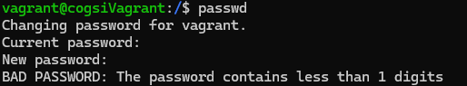
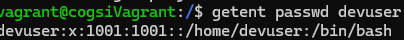
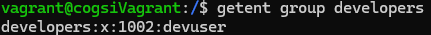
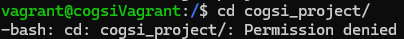
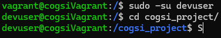

# CA4

## Parte 1

### Instalação do Ansible

Começou-se por instalar o Ansible utilizando o *WSL*. Os seguintes passos foram tomados para realizar esta instalação:

1. Instalou-se o pacote *software-properties-common* que contém ferramentas para adicionar e gerir repositórios em sistemas *Ubuntu*:
   
   ```
   sudo apt install software-properties-common
   ```

2. Adicionou-se o repositório do *Ansible* ao sistema:
   
   ```
   sudo add-apt-repository --yes --update ppa:ansible/ansible
   ```

3. Instalou-se o *Ansible* na máquina:
   
   ```
   sudo apt install ansible
   ```

Para ser possível correr o *Vagrant* no *WSL* foi necessário realizar um conjunto de configurações no mesmo:

1. Instalar o *Vagrant* no *WSL* (garantir que a versão é compatível):
   
   ```
   wget https://releases.hashicorp.com/vagrant/2.4.2/vagrant_2.4.2-1_amd64.deb
   sudo apt install ./vagrant_2.4.2-1_amd64.deb
   ```

2. Alterar o ficheiro *.bashrc* (localizado no diretório *home* do utilizador no *WSL*) e adicionar o seguinte conteúdo:
   
   ```
   export VAGRANT_WSL_WINDOWS_ACCESS_USER_HOME_PATH="/MNT/c/User/{nomeuser}"
   export VAGRANT_WSL_ENABLE_WINDOWS_ACCESS=1
   ```
   
   O primeiro comando indica o caminho para a pasta *Home* do utilizador do sistema *Windows*.
   
   O segundo comando permite que o *WSL* (*Windows Subsystem for Linux*) acesse o sistema de ficheiros do *Windows*, já que, por defeito, o *WSL* cria uma camada de isolamento em relação ao sistema *Windows*. Esse comando facilita a comunicação entre o *WSL* e o *Windows*, permitindo funcionalidades adicionais como o acesso/execução de programas do *Windows* e a configuração de pastas partilhadas.

3. Instalar o *plugin* *virtualbox_WSL2*:
   
   ```
    vagrant plugin install virtualbox_WSL2
   ```
   
   O plugin para Vagrant melhora o comportamento do `vagrant up` e `vagrant ssh` quando executados no *WSL2*, realizando duas ações:
   
   1. Cria uma segunda entrada de redirecionamento de porta para o endereço `0.0.0.0`, permitindo o acesso *SSH* à VM do *VirtualBox* a partir do *WSL2*, utilizando o IP da máquina Windows em vez de `localhost`;
   2. Seleciona automaticamente o endereço de IP do Windows ao executar o comando `vagrant ssh`, em vez de utilizar `localhost`;

4. Adicionar o seguinte código ao ficheiro *wsl.conf* localizado no diretório *etc*:
   
   ```
   [automount]
   enabled = true
   root = /mnt/
   options = "metadata,umask=77,fmask=11"
   mountFsTab = false 
   
   [network]
   networkingMode = "mirrored" - por causa do ssh do ansible
   ```

5. Adicionar as seguintes configurações ao *VagrantFile* de forma a redirecionar o porto 22 (do *SSH*) para o *WSL* se conseguir conectar a cada uma delas:
   
   ```
   tutRest.vm.network "forwarded_port", guest: 22, host: 2223, id: "ssh_host1"
   tutRestDB.vm.network "forwarded_port", guest: 22, host: 2224, id: "ssh_
   ```

6. Executar o seguinte comando:
   
   ```
   ln -s /mnt/c/Users/<User>/.ssh ~/.ssh
   ```
   
   Este comando cria um **link simbólico** da pasta de chaves SSH do Windows para a pasta *.ssh* no diretório *home* do *WSL*.
   
   O WSL não acede diretamente aos ficheiros do Windows, mas com este comando permite-se que o *WSL* aceda às chaves *SSH* armazenadas no Windows.

7. Alterar as permissões da chave privada para que apenas o *owner* da mesma tenha permissão de leitura e escrita sobre essa chave:
   
   ```
   chmod 600 ~/.ssh/vagrantCA3Key
   ```

8. Alterar as permissões da chave pública para que todos tenham acesso de leitura à mesma, mas apenas o *owner* a possa alterar:
   
   ```
   chmod 644 ~/.ssh/vagrantCA3Key.pub
   ```

9. Alterar novamente o ficheiro *.bashrc* adicionando-se o conteúdo abaixo:
   
   ```
   eval $(ssh-agent -s)
   ssh-add ~/.ssh/vagrantCA3Key
   ```
   
   O primeiro comando permite iniciar o *SSH agente*, que mantém as chaves *SSH* carregadas em memória, permitindo a autenticação automática.
   O segundo comando adiciona a nossa chave privada ao *SSH agent* para que o mesmo a utilize na autenticação automática.
   
   O ponto positivo de adicionar estes comandos ao ficheiro mencionado é que os automatiza sempre que se abre uma nova sessão no *WSL*.
   
   Para aplicar as alterações do ficheiro pode ser executado o comando *source .bashrc*.

Esta instalação foi baseada na seguinte documentação: [Vagrant and Windows Subsystem for Linux | Vagrant | HashiCorp Developer](https://developer.hashicorp.com/vagrant/docs/other/wsl).

Ficheiro *inventory.ini* (onde foram definidos os *hosts*):

   ```
   [all]
   host1 ansible_ssh_host=172.28.144.1 ansible_ssh_port=2222 ansible_ssh_user=vagrant ansible_ssh_private_key_file=~/.ssh/vagrantCA3Key ansible_ssh_common_args='-o StrictHostKeyChecking=no'
   host2 ansible_ssh_host=172.28.144.1 ansible_ssh_port=2224 ansible_ssh_user=vagrant ansible_ssh_private_key_file=~/.ssh/vagrantCA3Key ansible_ssh_common_args='-o StrictHostKeyChecking=no'
   ```

### Utilizar o Ansible Como o *Provisioner* das Máquinas

Começou-se por criar um conjunto de ficheiros *yml* (*playbooks*) na *root* do diretório, mais precisamente dois ficheiros (um para cada uma das máquinas).

1. Primeiramente realizou-se a criação de um ficheiro que contém um conjunto de tarefas semelhantes a ambos os *playbooks*: 
   
   ```yml
   ---
   - name: Atualiza a cache de pacotes
     apt:
       update_cache: yes
   
   - name: Atualiza os pacotes
     apt:
       upgrade: dist
       force_apt_get: yes
   
   - name: Instalar o JDK
     apt:
       name: openjdk-17-jdk
       state: present
   
   - name: Instalar o GIT
     apt:
       name: git
       state: present
   
   - name: Garantir que o diretório .ssh exista
     file:
       path: /home/vagrant/.ssh
       state: directory
       mode: '0700'
     become_user: vagrant
   
   - name: Adicionar GitHub aos hosts conhecidos
     known_hosts:
       path: /home/vagrant/.ssh/known_hosts
       name: github.com
       key: "{{ lookup('pipe', 'ssh-keyscan github.com') }}"
     become_user: vagrantome/vagrant/.ssh/known_ho
   
   - name: Clonar o repositório do serviço REST
     git:
       repo: "git@github.com:1181210/cogsi2425-1181210-1190384-1181242.git"
       dest: /cogsi_project
       version: main
       accept_hostkey: yes
       update: yes  # Garante que o repositório seja atualizado 
   ```
   
   - A **primeira e segunda tarefa** garentem que o sistema tenha todos os pacotes atualizados com as versões mais recentes. Para isso é utilizado o módulo *apt* do *ansible*.
     
     O *update-cache: yes* atualiza a *cache* local dos pacotes antes de realizar qualquer operação de instalação ou atualização.
     
     O *force_apt_update: yes* força a utilização do *apt-get* em vez do *apt* para realizar a atualização dos pacotes (garante compatibilidade com sistemas antigos);
   
   - A **teceira tarefa** utiliza novamente o módulo *apt* para instalar o pacote *openjdk-17-jdk*. Para além disso, utilizou-se o *state: present* que garante que o pacote esteja instalado (caso já se encontre instalado, não será instalado novamente, mantendo-se assim o conceito de **idempotência**);
   
   - A **quarta tarefa** é semalhante à anterior mas com o intuíto de instalar o *Git* (também se utiliza o conceito do *state*, garantindo-se **idempotência**);
   
   - A **quinta tarefa** utiliza o módulo *file* do *ansible* (que permite gerir ficheiros e diretórios) para garantir que o diretório *ssh* do utilizador *vagrant* exista e tenha permissões corretas. Nesta também se o utiliza o *state: directory* que garante que o *path* seja um diretório e, caso não exista, cria-o (**idempotência**). 
     
     Utiliza-se também o *`become_user: vagrant* de forma a garantir que o *ansible* executa a tarefa com o utilizador *vagrant* em vez de um utilizador local, evitando-se problemas de permissões;
   
   - A **sexta tarefa** utiliza o módulo *known_hosts* para adicionar o *GitHub* aos *known_hosts* (prevenindo o alerta de segurança quando o *GitHub* é acedido pela primeira vez);
     
     O *path: /home/vagrant/.ssh/known_hosts* indica o caminho para o ficheiro *known_hosts* onde a chave será armazenada.
     
     O *name: github.com* indica o nome do *host*.
     
     O *key: "{{ lookup('pipe', 'ssh-keyscan github.com') }}"* indica a chave pública a utilizar (a mesma é procurada através do comando *ssh-keyscan*).
     
     É novamente utilizado o *become_user: vagrant* pelas mesmas razões mencionadas no passo anterior.
     
     Esta tarefa também garante o conceito de **idempotência**.
   
   - A **sétima tarefa** utiliza o módulo *git* para clonar o repositório configurando o endereço do repositório (*repo*), o diretório de destino (*dest*), o *branch* a ser clonado (*version*), a aceitação automática da chave do *GitHub* (*accept_hostkey*) e a atualização do repositório caso o diretório de destino já exista (*update*), mantendo o *become_user: vagrant* para garantir as permissões adequadas.

2. O primeiro *playbook* referente ao *host1* (servidor *tutRest*) tem o seguinte conteúdo:
   
   ```yml
   ---
   - name: Deploy e Configuração do serviço Tut-Rest
     hosts: host1
     become: true
     become_method: sudo
   
     tasks:
       - import_tasks: install_and_configure_machine.yml
   
       - name: Verificar se o serviço no host2 está em funcionamento
         command: systemctl is-active h2
         delegate_to: host2  
         register: host2_service_status
         until: host2_service_status.stdout == 'active' 
         retries: 15        
         delay: 10          
         failed_when: host2_service_status.stdout != 'active'  
         become: true       
         become_user: root  
   
       - name: Copiar o serviço para o diretório do system
         template:
           src: "nonrest.service"
           dest: "/etc/systemd/system/nonrest.service"
           mode: 0755
         tags: install,systemd
         become: true       
         become_user: root  
   
       - name: Recarregar o systemd para reconhecer o serviço
         ansible.builtin.systemd:
           daemon_reload: true
         become: true       
         become_user: root 
   
       - name: Garantir que o serviço nonREST está ativo
         ansible.builtin.systemd:
           name: nonrest
           enabled: true
           state: started
         become: true       
         become_user: root 
   ```
   
   Este *playbook* define o **host1** como alvo das tarefas e requer permissões *sudo* para a sua execução, sendo estas necessárias para algumas das operações.
   
   A **primeira tarefa** utiliza o comando *import_tasks* para importar e executar sequencialmente as tarefas definidas no ficheiro descrito no ponto 1.
   
   A **segunda tarefa** verifica se o serviço *H2* (base de dados) está ativo no *host2*, utilizando o comando *systemctl is-active h2*, sendo o *h2* o nome do serviço dado no *host2*. Esta verificação é delegada ao *host2*, sendo repetida 15 vezes com intervalos de 10 segundos entre essas repetições. Isto garante que o *host1* espere pela inicialização completa do serviço do *host2*.  
   
   A **terceira tarefa** copia o ficheiro de configuração do serviço *nonrest.service* para o diretório */etc/systemd/system* com as permissões adequadas (0755). O ficheiro *nonrest.service* pode ser observado de seguida:
   
   ```
   [Unit]
   Description=Aplicação nonREST - Serviço
   After=network.target
   
   [Service]
   Type=simple
   User=root
   WorkingDirectory=/cogsi_project/CA2/tutRestGradle/nonrest
   ExecStart=/cogsi_project/CA2/tutRestGradle/gradlew bootRun
   Restart=on-failure
   
   [Install]
   WantedBy=multi-user.target
   ```
   
   Este ficheiro configura o serviço **nonREST** para ser executado automaticamente com o utilizador *root* assim que a rede estiver configurada e ativa. Para além disso, define o diretório de trabalho (*/cogsi_project/CA2/tutRestGradle/nonrest*) e utiliza o comando *gradlew bootRun* para iniciar a aplicação. O serviço será reiniciado automaticamente caso ocorra alguma falha. Por fim, é utilizado o *WantedBy=multi-user.target* para que o serviço seja carregado no modo *multiuser*, não necessitando da interface gráfica. Como uma tarefa idempotente, esta etapa só copiará o ficheiro se ele tiver sido modificado ou não estiver presente.
   
   A **quarta tarefa** recarrega o *systemd* (através do *daemon_reload*) obrigado-o a ler novamente todos os ficheiros de configuração. Este é essencial para que o *systemd* reconheça as mudanças realizadas. Mais uma vez a tarefa é idempotente dado que o *daemon_reload* só atualiza o que foi alterado.
   
   A **quinta tarefa** assegura que o serviço *nonREST* esteja ativo e configurado para iniciar automaticamente. A instrução *state: started* verifica se o serviço está em execução, enquanto *enabled: true* o configura para iniciar automaticamente no *boot*. Essa tarefa é idempotente porque, se o serviço já estiver ativo e configurado para iniciar, ela não fará nenhuma alteração.
   
   Todas estas tarefas são executadas com permissões elevadas (*become:true* e *become:root*) garantido o sucesso da sua execução.

3. O segundo *playbook* referente ao *host2* (servidor *h2*) tem o seguinte conteúdo:
   
   ```yml
   ---
   - name: Deploy e Configuração do serviço H2
     hosts: host2
     become: true
     become_method: sudo
     gather_facts: no
   
     tasks:
       - import_tasks: install_and_configure_machine.yml
   
       - name: Instalar ufw
         apt:
           name: ufw
           state: present
   
       - name: Permitir o acesso SSH
         ufw:
           rule: allow
           name: OpenSSH
           state: enabled
   
       - name: Permitir a porta 9092 do IP 192.168.33.10
         ufw:
           rule: allow
           from_ip: 192.168.33.10
           to_port: 9092
           proto: tcp
           state: enabled
   
       - name: Bloquear todas as outras conexões na porta 9092
         ufw:
           rule: deny
           to_port: 9092
           proto: tcp
           state: enabled
   
       - name: Ativar o ufw no boot
         ufw:
           state: enabled
   
       - name: Copiar o serviço para o diretório do system
         template:
           src: "h2.service"
           dest: "/etc/systemd/system/h2.service"
           mode: 0755
         tags: install,systemd
         become: true       
         become_user: root  
   
       - name: Recarregar o systemd para reconhecer o serviço
         ansible.builtin.systemd:
           daemon_reload: true
         become: true      
         become_user: root  
   
       - name: Garantir que o serviço h2 está ativo
         ansible.builtin.systemd:
           name: h2
           enabled: true
           state: started
         become: true      
         become_user: root  
   ```
   
   Este *playbook* define o **host2** como alvo das tarefas e requer permissões *sudo* para a sua execução, sendo estas necessárias para algumas das operações.
   
   A **primeira tarefa** utiliza novamente o comando *import_tasks* para importar e executar sequencialmente as tarefas definidas no ficheiro descrito no ponto 1.
   
   A **segunda tarefa** utiliza o módulo *apt* para instalar o pacote *ufw*. A opção *state:present* garante o conceito de **idempotência**, sendo que o pacote apenas é instalado caso não esteja presente no sistema.
   
   A **terceira tarefa** utiliza o módulo *ufw* para garantir que a regra do *OpenSSH* esteja ativa. Mais uma vez utiliza-se o conceito *state: enabled* para que a mesma só seja ativada caso ainda não o esteja.
   
   A **quarta tarefa** utiliza novamente o módulo *ufw* de forma a adicinar uma regra que permite comunicação proveniente do endereço de IP *192.168.33.10* (*host1*) para a porta *9092* utilizando-se o protocolo TCP. A mesma só é configurada caso ainda não exista no sistema (*state: enabled*).
   
   A **quinta tarefa** adiciona uma regra ao *ufw* que nega qualquer outra comunicação para a porta *9092*. Ou seja, apenas comunicações por parte do *host1* são permitidas nesta porta. Esta regra apenas é adicionada caso ainda não esteja configurada.
   
   A **sexta tarefa** ativa o *ufw* no *boot* do sistema, garantindo que a *firewall* seja ativada automaticamente. Esta regra apenas será aplicada caso ainda não o esteja.
   
   As restantes tarefas têm um comportamente semalhante ao já demonstrado nas tarefas do *host1*, mas com o intuíto de correr o serviço *h2*.

### Utilizar o Ansible para configurar o PAM

Para configurar o *PAM* de forma a que o mesmo exiga uma política de complexidade nas *passwords* do sistema foram adicionadas as seguintes tarefas ao ficheiro *install_and_configure_machine.yml* que é executado em ambos os *hosts*:

```
- name: Instalar o libpam-pwquality
  package:
    name: "libpam-pwquality"
    state: present

- name: Configurar o pam_pwquality
  lineinfile:
    path: "/etc/pam.d/common-password"
    regexp: "pam_pwquality.so"
    line: "password required pam_pwquality.so minlen=12 lcredit=-1ucredit=-1 dcredit=-1 ocredit=-1 retry=3 enforce_for_root"
    state: present
```

As regras de *password* definidas são:

- Mínimo de 12 caracteres;

- Uma letra minúscula;

- Uma letra maiúscula;

- Um algarismo numérico;

- Um algarismo alfanumérico;

- Três tentativas;

- Desativar o *root override*;

Na tarefa **Instalar o libpam-pwquality** utiliza-se o módulo *package* do *Ansible* para instalar o pacote *libpam-pwquality*, dado que este permite definir requisitos para as *passwords*. Este pacote apenas é instalado caso ainda não esteja presente no sistema.

A tarefa **Configurar o pam_pwqu** configura as políticas mencionadas anteriormente utilizando o módulo *pam_pwquality*. Para isso é utilizado o módulo *lineinfile* que permite garantir que uma linha esteja presente/ausente num ficheiro. Neste caso utiliza-se este módulo para procurar por uma linha que contenha o texto "pam_pwquality.so" no ficheiro de configuração indicado (*path: /etc/pam.d/common-p*). Caso esta linha já exista, ela será substituída pela linha indicada na variável *line*. 

A *line* mencionada especifica as seguintes condições:

- Comprimento mínimo de 12 caracteres (**minlen=12**);

- A exigência de pelo menos um caractere minúsculo (**lcredit=-1**);

- A exigência de pelo menos um caractere maiúsculo (**ucredit=-1**);

- Um número (**dcredit=-1**);

- Um caractere especial (**ocredit=-1**);

- Três tentativas **(retry=3)**;

- Aplicação ao utilizador *root* **(enforce_for_root)**;

O *state: present* faz com que a linha seja mantida no ficheiro, sendo apenas adicionada no caso de ainda não existir. Abaixo pode ser observada a imagem que demostra esta política em funcionamento:



### Utilizar o Ansible para criar o grupo *developers* e o utilizador *devuser*

De forma a criar o grupo *developers* e o utilizador *devuser* alterou-se o ficheiro *install_and_configure_machine.yml* que é executado em ambos os *hosts*:

```yml
- name: Criar o utilizador 'devuser'
  user:
    name: devuser
    shell: /bin/bash
    password: $6$OStSJfA6FA$ffSDaJBWfSpmnwlC6QWJwLG3PgZWQhPYUSezmRvSiUFpwSWy/57KuUuLg/4yGBpKx2TWYsPDz9Yq7nL2I2XT3/

- name: Garantir que o grupo 'developers' existe
  group:
    name: developers
    state: present

- name: Atribuir o utilizador 'devuser' ao grupo 'developers'
  user:
    name: devuser
    groups: developers
    append: yes
```

A tarefa **Criar o utilizador 'devuser'** utiliza o módulo *users* para criar o utilizador *devuser*. Nesta define-se o utilizador (*name*), a *shell* do mesmo e a sua *password* encriptada (esta já segue o requisitos mencionados no ponto anterior). É de notar que para efeitos de produção a *password* não deve estar explícita.  Este módulo segue por natureza o conceito de **idempotência** dado que verifica se já existe um utilizador presente no sistema com o *user* e *shell* definidos, criando apenas um novo utilizador caso este ainda não exista (**nota:** a *password* é sempre atualizada).

A tarefa **Garantir que o grupo 'developers' existe** cria o grupo *developers* no sistema caso o mesmo ainda não exista. 

A tarefa **Atribuir o utilizador 'devuser' ao grupo 'developers'** adiciona o utilizador criado ao grupo *developers* caso o mesmo ainda não faça parte deste grupo. A opção *append: yes* assegura que o mesmo se mantenha em outros grupos que já esteja inserido. 

Utilizador *devuser* no sistema:



Grupo *developers* no sistema:



### Configuração do Acesso às Aplicações

De forma a permitir que apenas os membros do grupo tenham acesso às aplicações foi novamente alterado o ficheiro *install_and_configure_machine.yml*:

```yml
- name: Criar o diretório de destino (se necessário)
  file:
    path: /cogsi_project
    state: directory
    owner: vagrant  
    group: vagrant  
    mode: '0770'  

- name: Clonar o repositório do serviço REST
  git:
    repo: "git@github.com:1181210/cogsi2425-1181210-1190384-1181242.git"
    dest: /cogsi_project
    version: main
    accept_hostkey: yes
    update: yes 
  become_user: vagrant

- name: Ajustar permissões para o diretório cogsi_project
  file:
    path: /cogsi_project
    state: directory
    mode: '0770'
    group: developers  
    owner: root
    recurse: true 
```

Neste alterou-se o diretório de destino do clone para outro diretório (antes era realizado para o *home* do utilizador *vagrant*). 

Na **primeira tarefa** utiliza o módulo *file* para criar o diretório *cogsi_project* caso este ainda não exista no sistema. Específica-se as permissões (*mode: 0770*), o dono e o grupo ao qual este pertençe. Utilizou-se inicialmente o *vagrant* dado que a tarefa está a ser executada com este utilizador e o mesmo necessita de permissões para efetuar o clone posterior. Este módulo já é **idempotente** por defeito. 

A **segunda tarefa** já foi abordada e realiza o clone para a pasta criada na tarefa anterior.

A **terceira tarefa** altera as permissões do diretório */cogsi_project* para que o apenas o proprietário *root* e o grupo *developers* tenham acesso e permissões totais ao mesmo (*0770*). Utiliza-se o *recurse: true* para aplicar estas alterações a todos os *subdiretórios*. Neste caso específico não é realizada **idempotência** dado que as permissões são sempre alteradas para que o utilizador *vagrant* possa clonar/atualizar o repositório (dado que já tem as chaves *ssh* na sua *home*) e depois altera-se novamente as permissões para o grupo *developers*. 

Acesso com o utilizador *vagrant*:



Acesso com o utilizador *devuser*:



### Garantir a Idempotência

Esta já foi demonstrada ao longo do documento.

## Solução alternativa ao Ansible
Nesta secção é detalhada uma solução alternativa à utilizada nesta iteração, o Ansible.

### Introdução
Foi realizada uma pesquisa de outras ferramentas semelhantes ao Ansible. Algumas das alternativas encontradas foram: o Puppet, o Chef, o SaltStack, entre outros.

Depois de analisadas todas as hipóteses, consideramos que a melhor alternativa para o projecto em questão seria o Puppet, uma vez que é uma ferramenta cujo principal objetivo é gerir a configuração e o estado dos sistemas de forma automatizada e consistente em diversas plataformas, como servidores físicos, máquinas virtuais e ambientes nuvem. Com o Puppet, é possível garantir que as máquinas estejam configuradas de acordo com padrões específicos, facilitando a escalabilidade e a manutenção de infraestruturas complexas. 

### Como é que o Puppet funciona?
O Puppet utiliza ficheiros de configuração chamados Manifests, geralmente escritos na sua própria linguagem, Puppet DSL (Domain Specific Language). Estes ficheiros especificam o estado desejado dos recursos do sistema, como pacotes instalados, serviços em execução e ficheiros configurados. No Puppet, a configuração é declarativa, o que significa que cada utilizador descreve o estado final desejado e o Puppet encarrega-se de aplicar as mudanças necessárias para alcançar esse estado.

Um Manifest é estruturado em diferentes seções principais, que incluem:
1. **Classes e Definições:**
   - Estruturas reutilizáveis que agrupam configurações. Por exemplo, uma classe pode definir toda a configuração necessária para um servidor web (instalação de pacotes, configuração de serviços, etc).
   - Classes facilitam a organização do código e permitem que configurações complexas sejam aplicadas em blocos lógicos.

2. **Nodes:**
   - No Puppet, um node é uma máquina específica (ou grupo de máquinas) que será configurada. Dentro de um Manifest, é possível definir configurações específicas para diferentes nodes, permitindo uma          
     personalização conforme o tipo de servidor ou a sua função (por exemplo, servidor de base de dados ou servidor de aplicação).

3. **Resource Types:**
   - O Puppet trabalha com difentes tipos de recursos que representam elementos do sistema, como packages, services, files e users. Cada tipo de recurso possui parâmetros que permitem definir o estado desejado.
   - Por exemplo, o recurso service pode ser configurado para garantir que um serviço específico esteja em execução (running) e ativado para iniciar automaticamente.

4. **Templates:**
   - Ficheiro de modelo, geralmente escritos em ERB (Embedded Ruby), que permitem gerar configurações dinâmicas. Os templates são especialmente úteis para gerar ficheiros de configuração a partir de variáveis ou condições.
   - No Manifest, é possível especificar um template que será processado para produzir um ficheiro final no sistema configurado.

5. **Hiera:**
   - É um sistema de gestão de dados hierárquico do Puppet, usado para armazenar dados externos ao Manifest, como variáveis de configuração específicas. Isso permite separar dados de configuração do código,         facilitando a reutilização e a modularização das configurações.

### Processo de execução do Puppet 
O Puppet geralmente segue um fluxo de execução no modelo cliente-servidor (Puppet Master e Puppet Agent):

1. **Puppet Agent:** O agente é um serviço que roda nos nós (máquinas) a serem configurados. Comunica com o Puppet Master para receber o estado desejado do sistema.

2. **Facter:** O agente executa o Facter, uma ferramenta integrada que recolhe informações sobre o nó (como sistema operacional, endereços IP, memória) e envia-as ao Puppet Master.

3. **Compilação do Catálogo:** Com base nos Manifests e nas informações do Facter, o Puppet Master compila um catálogo – uma coleção de configurações específicas para aquele nó.

4. **Aplicação da Configuração:** O Puppet Agent aplica o catálogo recebido no sistema, garantindo que corresponda ao estado desejado definido nos Manifests.

5. **Relatórios:** O agente gera relatórios sobre o status da configuração e envia-os ao Puppet Master para monitorizar e para auditoria.


### Vantagens do Puppet

1. **Escalabilidade:** Adequado para infraestruturas de grande escala, onde é necessário gerir milhares de servidores.
   
2. **Idempotência:** O Puppet é idempotente, ou seja, aplicar a mesma configuração várias vezes não causará mudanças indesejadas.

3. **Extensibilidade:** Através de módulos, templates e Hiera, o Puppet permite configurações avançadas e reutilizáveis.

4. **Amplo suporte a múltiplas plataformas:** Puppet é compatível com sistemas como Linux, Windows e macOS, o que facilita a padronização em ambientes heterogéneos.


### Em Comparação com Ansible e outras ferramentas

Fator de comparação | Ansible | Puppet | Chef | SaltStack | 
| --------------------- | ------------------ | --------------- | ---------- | ---------- |
| Linguagem | YAML | Puppet DSL | Ruby | YAML| 
| Performance | Rápida, desenhado para ambientes pequenos | Lenta, mas com grande escalabilidade, sendo viável para maiores projetos | Lenta, desenhado para maiores ambientes | Rápida, mantendo a eficiência em projetos de maior escala. |
| Segurança | Comunicação via SSH | Comunicação encriptada até ao Puppet Master | Comunicação encriptada para o Chef Server | Comunicação via SSH | 
| Complicação de instalação | Como comunica por SSH, não necessita de setup na máquina | Necessita de instalação do puppet em cada máquina gerida por este, de forma a comunicar com Puppet Master | Necessita de configuração de Chef server e Chef client | Pode ser configurado com sistema Master-Agent, ou agentless, sendo agentless mais limitado em termos de *features* mas mais simples de instalar |
| Relatórios | Necessita de ferramentas externas para realizar relatórios | Tem sistema integrado de relatórios e compatibilidade com ferramentas externas | Tem sistema integrado de relatórios e compatibilidade com ferramentas externas | Tem sistema integrado de relatórios e compatibilidade com ferramentas externas |
| Extensibilidade | Modular, utilizando playbooks em YAML  | Através de módulos, templates e Hiera, permitindo configurações avançadas e reutilizáveis | Modular, através de *Recipes* e *Cookbooks* escritos em Ruby | Contém Salt States em YAML, como também suporta módulos em Python | 

## Implementação do CA4 com o Puppet

### Instalação do Puppet

A instalação do Puppet não é necessária na máquina host, pois este pode ser instalado diretamente na máquina virtual.
Neste caso foi utilizado um conjunto de comandos shell na Vagrantfile, para instalar os módulos necessários do puppet, no caso de ainda não se encontrarem instalados:

```
    # Update package list
    if ! command -v puppet >/dev/null 2>&1; then
      sudo apt-get update
      sudo apt-get install -y puppet
      sudo puppet module install puppetlabs-vcsrepo
    fi
```

A utilização de um bloco if garante a idempotência da instalação, garantindo que não há redundância nas chamadas de comandos.

Adicionalmente ao puppet, foi também instalado o módulo `puppetlabs-vcsrepo`, utilizado para clonar repositórios git.

### Utilizar o Puppet Como o *Provisioner* das Máquinas

1. Para os Provisions comuns, foi criado um ficheiro puppet manifest (.pp) para realizar todas as tarefas de provision.

```
package { 'git':
    ensure => 'installed',
}
package { 'openjdk-17-jdk':
    ensure => 'installed',
}
package { 'ufw':
    ensure => 'installed',
}
```
O comando package é utilizado para garantir que um package esteja instalado, realizando a instalação apenas necessário, se o parâmetro `ensure => 'installed'` for utilizado.

```
file { '/home/vagrant/.ssh':
  ensure => 'directory',
  owner  => 'vagrant',
  mode   => '0700',
}

exec { 'Add known hosts':
  command => 'ssh-keyscan -H github.com >> /home/vagrant/.ssh/known_hosts',
  user        => 'vagrant',
  environment => ['HOME=/home/vagrant'],
  path        => ['/usr/bin', '/usr/local/bin'],
  creates => '/home/vagrant/.ssh/known_hosts',
}
```

Aqui, é garantida a existência da pasta .ssh e a existência do github.com no ficheiro "known_hosts" dessa mesma pasta. É utilizado o comando file, utilizado para garantir a existência de ficheiros ou diretórios e configurar as suas permissões, e o comando exec, utilizado para executar comandos SSH.

```
vcsrepo { '/cogsi_project/cogsi2425-1181210-1190384-1181242':
  ensure   => present,
  provider => git,
  source   => 'git@github.com:1181210/cogsi2425-1181210-1190384-1181242.git',
  user     => 'vagrant'
}
```

Finalmente, esta declaração é utilizada para clonar o repositório git, em nome do utilizador vagrant, sendo este o utilizador que contém as chaves SSH necessárias para a autenticação neste repositório. A propriedade "ensure" no estado `present` outra vez garante idempotência, não realizando clonagem se este repositório já existir. 
Como o nome indica, vcsrepo é apenas um comando possível de executar se o módulo Puppet puppetlabs-vcsrepo se encontrar instalado.

2. Para a firewall foram executados os seguintes comandos:
```
exec { 'enable_ufw':
  command => 'ufw enable',
  path => ['/usr/sbin', '/bin', '/usr/bin'],
  onlyif  => 'ufw status | grep -q "Status: inactive"',
  require => Package['ufw'],
}

exec { 'allow_app_ip_on_db_port':
command => "ufw allow from 192.168.33.11 to any port 9092",
path => ['/usr/sbin'],
require => Exec['enable_ufw'],
}

exec { 'deny_db_port':
command => "ufw deny 9092",
path => ['/usr/sbin'],
require => Exec['allow_app_ip_on_db_port'],
}

exec { 'reload_ufw':
  command => 'ufw reload',
  path => ['/usr/sbin' ],
  require => Exec['deny_db_port'],
}
```
Foi executada uma sequência de comandos shell, que realizam a ativação e configuração de UFW, permitindo acesso ao porto 9092 pela base de dados, e negando qualquer outro endereço de utilizar esse porto.
É utilizado o parâmetro require para garantir que cada comando acontece em sequência, e o parâmetro onlyif para garantir que é apenas configurada a *firewall* se esta não estiver já configurada, garantindo idempotência.

3. Para os provisioners de cada máquina, apenas foram inseridos recursos para executar as respetivas *tasks* do projeto "tutRest" em *gradle*.

Provision para a base de dados:
```
exec { 'run_gradle_module_task':
  command => '/cogsi_project/cogsi2425-1181210-1190384-1181242/CA2/tutRestGradle/gradlew :nonrest:startH2Server &', 
  cwd     => '/cogsi_project/cogsi2425-1181210-1190384-1181242/CA2/tutRestGradle', 
  user    => 'devuser',
  logoutput => true,
}
```
Partindo da localização do projeto, é executado o projeto gradle para o módulo :nonrest:startH2Server.

Provision para o servidor:
```
exec { 'wait_for_db_vm':
  command   => '/bin/bash -c "while ! /usr/bin/nc -z 192.168.33.11 9092; do
                  sleep 5;
                done;',
  user      => 'devuser',
  logoutput => true,
  unless    => '/usr/bin/nc -z 192.168.33.11 9092', 
}

exec { 'run_gradle_task':
  command   => '/cogsi_project/cogsi2425-1181210-1190384-1181242/CA2/tutRestGradle/gradlew :nonrest:bootRun &',
  cwd       => '/cogsi_project/cogsi2425-1181210-1190384-1181242/CA2/tutRestGradle',
  user      => 'devuser',
  logoutput => true,
  onlyif     => '/bin/bash -c \"! netstat -tuln | grep \":8080\"\"',
  require   => Exec['wait_for_db_vm'],
}
```
Aqui é aberto o servidor do mesmo projeto, para a máquina virtual deste servidor. Um aspeto importante é a utilização de um pequeno script para realizar a espera pela abertura do porto 9092 no endereço da base de dados.
Este script é criado como uma dependência para a execução do recurso "run_gradle_task", ou seja, o servidor gradle apenas será executado após ser detetada a base de dados.

### Utilizar o Puppet para configurar o PAM

Para configurar pam, foi utilizada uma sequência de recursos:

```
package { 'libpam-pwquality': 
  ensure => present,
}

file { '/etc/pam.d/common-password':
  ensure  => file,
  content => "password required pam_pwquality.so minlen=12 lcredit=-1ucredit=-1 dcredit=-1 ocredit=-1 retry=3 enforce_for_root",
  notify  => Exec['pam-configure'],
}

exec { 'pam-configure':
  command => '/usr/sbin/pam-auth-update',
  path    => ['/usr/sbin', '/usr/bin'],
  onlyif  => 'test -f /etc/pam.d/common-password',
}
```

É garantida a existência da package 'libpam-pwquality', e de seguida é criado o ficheiro /etc/pam.d/common-password, utilizando o parêmetro "content" para inserir o conteúdo da configuração do ficheiro, este o mesmo já referido na configuração *Ansible*. Após é executado o recurso "pam-configure", executado diretamente após do recurso anterior, devido à utilização de "notify" neste. Aqui é feita a atualização das novas configurações, utilizando `/usr/sbin/pam-auth-update`.

### Utilizar o Puppet para criar o grupo *developers* e o utilizador *devuser*

Para a criação deste novo grupo e novo utilizador foram criados os seguintes recursos: 

```
group { 'developers':
  ensure => present,
}

user { 'devuser':
  ensure     => present,
  gid        => 'developers',
  home       => '/home/devuser',
  managehome => true,
  shell      => '/bin/bash',
}
```

O primeiro certifica a existência de um grupo "developers", enquanto o segundo garante a existência de um utilizador "devuser", pertencente ao grupo e com as configurações de home path e shell definidas.

Para a delegação de permissões da base de dados e do projeto tutRest, foi feito o seguinte:

```

file { '/cogsi_project':
  ensure => 'directory',
  owner  => 'devuser',
  group  => 'developers',
  mode   => '0770',
}

vcsrepo { '/cogsi_project/cogsi2425-1181210-1190384-1181242':
  ensure   => present,
  provider => git,
  source   => 'git@github.com:1181210/cogsi2425-1181210-1190384-1181242.git',
  user     => 'vagrant'
}

file { '/shared':
  ensure => present,
  owner  => 'devuser',
  group  => 'developers',
  mode   => '0770',
  source => '/shared',
}
```

De forma a garantir que não existem complicações a alterar permissões de acesso de uma pasta git dinamicamente em cada processo de provision, foi criada uma pasta `cogsi_project` com acesso associado ao grupo developers. Dentro desta, vcsrepo garante a existência do repositório em cada VM, garantindo que está encapsulado em uma pasta pertencente ao grupo developers.
Da mesma forma, a pasta partilhada `/shared`, onde os ficheiros de base de dados são dispostos, é garantida presente como parte do grupo developers.

### Garantir a Idempotência

Ao longo desta configuração, a idempotência foi garantida através da utilização dos parâmetros "ensure", "onlyif", e "require" que fazem com que cada recurso seja apenas utilizado em caso de ser necessário, evitando redundâncias. O puppet como ferramenta tem como foco no seu *design* a idempotência, garantindo consistência nas suas configurações.