# CA5

## Considerações comuns Docker

Ao longo deste relatório, vários comandos serão inseridos no ficheiro *Dockerfile*, de forma a exercer uma variedade de objetivos.
Para evitar redundância, segue-se a explicação de um conjunto de comandos comuns que irão ser utilizados na criação de várias imagens:

- O magic comment ```# syntax=docker/dockerfile:1``` indica ao docker que a sintaxe utilizada no *Dockerfile* é `docker/dockerfile:1`;
- O comando ```FROM ubuntu:22.04``` define a imagem base a partir da qual o *Dockerfile* será construído;
- O comando CMD define o comando a executar ao iniciar um *container* criado a partir da imagem definida;

## Parte 1

### Versão 1

#### Criação da imagem para o projeto Spring com docker

Para a criação da imagem pedida começou-se por criar um ficheiro de extensão *Dockerfile* (mais propriamente *nonrest.Dockerfile*) ao qual se adicionou a seguinte configuração:

```dockerfile
# syntax=docker/dockerfile:1
FROM ubuntu:22.04

# Instalar as dependências
RUN apt-get update && apt-get install -y git curl vim openjdk-17-jdk

# Criar uma pasta .ssh na home do utilizador root
RUN mkdir /root/.ssh && chmod -R 700 /root/.ssh

# Copiar a chave privada da pasta .ssh do host para a imagem
COPY id_ed25519 /root/.ssh/id_rsa

# Alteração de permissões e configurações do ssh
RUN chmod 0400 /root/.ssh/id_rsa && echo "StrictHostKeyChecking no" > /root/.ssh/config

# Adicionar o github aos 'known_hosts'
RUN ssh-keyscan github.com >> /root/.ssh/known_hosts

RUN eval "$(ssh-agent -s)" && ssh-add /root/.ssh/id_rsa

# Realizar o clone do repositório
RUN git clone git@github.com:1181210/cogsi2425-1181210-1190384-1181242.git cogsi

# Definir o diretório de trabalho como sendo a pasta nonrest
WORKDIR /cogsi/CA2/tutRestGradle/nonrest

# Remover as application.properties (utilizadas para executar a base de dados num servidor - não é necessário para esta iteração)
RUN rm -rf src/main/resources/application.properties

# Porta que irá ser utilizada pela aplicação (apenas para documentação)
EXPOSE 8000

# Comando para executar a aplicação
CMD ["../gradlew", "bootRun"]
```

1. Utilizou-se o comando *RUN* do *Docker* de forma a atualizar os pacotes disponíveis no repositório Ubuntu (*apt-get update*) e instalou-se os pacotes necessários (*git*, *curl*, *vim* e *openjdk-17-jdk*);

2. Utilizou-se novamente o comando *RUN* de forma a criar o diretório *.ssh* na *home* do utilizador *root*. Este diretório é posteriormente utilizado para armazenar a chave privada utilizada para o *clone* do repositório. Para além disso, definiram-se as permissões seguras (apenas o proprietário tem acesso à mesma);

3. De seguida, copiou-se o ficheiro `id_ed25519` (chave privada SSH) do *host* para o diretório .ssh do *container*, utilizando-se o comando *COPY*;

4. Para além disso, definiram-se as permissões da chave, desativou-se a verificação de autenticidade do *host* e adicionou-se o *GitHub* aos `known_hosts` de forma a garantir que conexões *SSH* a este não gerem avisos de segurança;

5. Iniciou-se o *ssh-agent* e adicionou-se a chave privada ao agente de forma a permitir conexões *SSH* durante o *build*;

6. Posteriormente, realizou-se o *clone* do projeto para a pasta *cogsi* e definiu-se o diretório para os comandos subsequentes (neste caso na pasta *nonrest*) utilizando o *WORDIR*;

7. Removeu-se o ficheiro `application.properties`, utilizado na conexão à base de dados. Para esta parte do trabalho o mesmo é desnecessário;

8. De seguida, utilizou-se o *EXPOSE* de forma a indicar o porto que a aplicação irá utilizar. É importante notar que este apenas é útil para efeitos de documentação, não publicando o porto automaticamente no *host*;

9. Por fim, recorreu-se ao *CMD* para executar a aplicação. Este será o comando executado quando o *container* iniciar, executando automaticamente a aplicação;

Após se ter configurado o ficheiro, utilizou-se o seguinte comando para realizar a geração da imagem:

```bash
docker build -f nonrest.Dockerfile --tag nonrest:1.0 --tag nonrest:latest .
```

Neste é especificado o nome do ficheiro (-f), as suas *tags* no formato "nome:versão" e o contexto da *build* (neste caso o próprio diretório).

Após se ter gerado a imagem utilizou-se o seguinte comando para executar um *container*:

```bash
docker run -p 8000:8080 nonrest
```

Utilizou-se o argumento "-p" para mapear os portos entre o *host* e o *container*. Neste caso o porto do *container* 8080 (onde aplicação está em execução) será acessível no *host* pelo porto 8000). Como a *tag* foi omitida, será utilizada automaticamente a *tag* *latest*.  
Após o *container* ser iniciado, foi verificado que a sua execução ocorreu com sucesso:

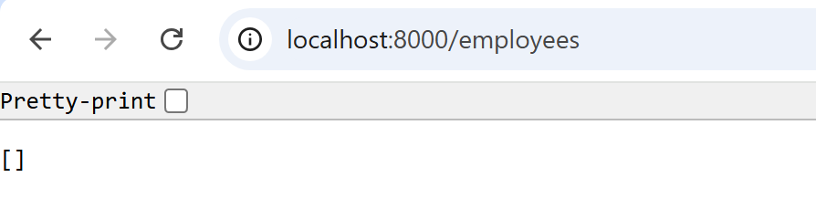

##### Diminuição do tamanho final da Imagem

De forma a diminuir o tamanho final da imagem, começou-se por executar o seguinte comando com o objetivo de verificar as diferentes camadas/comandos executados para a criação da mesma:

```bash
docker history nonrest
```

A partir deste comando obteve-se o seguinte resultado:

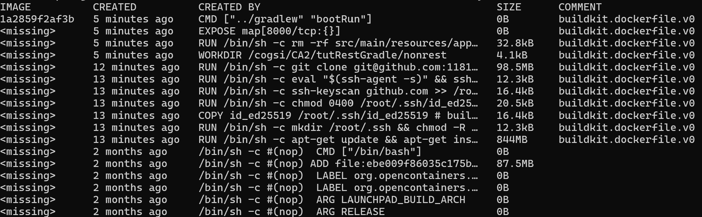

Da análise do resultado acima, pode-se verificar que a etapa que atualiza/instala os pacotes está a fazê-lo diretamente na imagem base. Isto resulta numa "camada" com 844MB. A segunda maior camada é a etapa que realiza o *clone* do repositório, ocupando 98MB. Para além disso, existem alumas camadas que são geradas devido a se utilizarem comandos *RUN* individuais, aumentando o tamanho total da imagem.

Para reduzir o tamanho final da imagem, foi utilizado o conceito de *Multi-stage builds*, que permite criar imagens mais compactas. Este processo envolve, numa primeira etapa, a utilização de uma imagem base para compilar a aplicação, e, numa segunda etapa, a cópia apenas dos ficheiros necessários para a imagem final.

Foram então realizadas as seguintes alterações do *Dockerfile* de forma a implementar o conceito mencionado:

```dockerfile
# syntax=docker/dockerfile:1
FROM ubuntu:22.04 as builder

# Instalar as dependências
RUN apt-get update && apt-get install -y git curl vim openjdk-17-jdk && rm -rf /var/lib/apt/lists/*

# Criar uma pasta .ssh na home do utilizador root
RUN mkdir /root/.ssh && chmod -R 700 /root/.ssh

# Copiar a chave privada da pasta .ssh do host para a imagem
COPY id_ed25519 /root/.ssh/id_ed25519

# Alteração de permissões e configurações do ssh
RUN chmod 0400 /root/.ssh/id_ed25519 && echo "StrictHostKeyChecking no" > /root/.ssh/config

# Adicionar o github aos 'known_hosts'
RUN ssh-keyscan github.com >> /root/.ssh/known_hosts

RUN eval "$(ssh-agent -s)" && ssh-add /root/.ssh/id_ed25519

WORKDIR /build
# Realizar o clone do repositório
RUN git clone git@github.com:1181210/cogsi2425-1181210-1190384-1181242.git cogsi
WORKDIR /build/cogsi/CA2/tutRestGradle/nonrest

# Remover as application.properties (utilizadas para executar a base de dados num servidor - não é necessário para esta iteração)
RUN rm -rf src/main/resources/application.properties

# Construir o projeto usando o Gradle e gerar o JAR
RUN ../gradlew clean build

# Stage 2: Ambiente runtime
FROM openjdk:17-jdk-slim

# Copiar apenas o jar da imagem de build
COPY --from=builder /build/cogsi/CA2/tutRestGradle/nonrest/build/libs/nonrest.jar /nonrest/nonrest.jar

# Definir o diretório de trabalho
WORKDIR /nonrest

# Expor a porta da aplicação
EXPOSE 8000

# Comando para iniciar a aplicação
CMD ["java", "-jar", "nonrest.jar"]
```

Neste caso o *Dockerfile* é constituído por duas fases distintas:

- **Primeira fase (*build*):** é gerada uma imagem base que contém o *openjdk-17-jdk* e a aplicação (obtida através do *clone* do repositório). Nesta fase são instaladas as dependências, configurado o *ssh*, *clonado* o repositório e a aplicação é compilada utilizando-se a tarefa *build* do *gradlew*, obtendo-se um *jar* executável. Os ficheiros gerados nesta fase **não** são incuídos na imagem final;

- **Segunda fase (runtime):** utiliza-se uma imagem base mais leve, o *openjdk-jdk-slim*, adequada apenas para a execução da aplicação. Nesta fase copia-se o ficheiro *jar* gerado na fase anterior (*--from=builder*) para a imagem final (neste caso para o diretório *nonrest*), define-se o diretório de trabalho para a nova pasta criada e executa-se a aplicação utilizando-se o *jar* copiado. 

Este conceito diminui consideravelmente o tamanho da imagem final uma vez que esta apenas contém os ficheiros necessários para executar a aplicação:

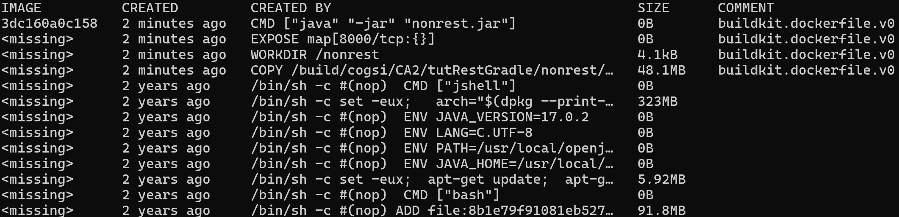

Pode-se observar a partir da figura que o tamanho diminuiu de 1.49GB (na primeira imagem criada) para 734MB:

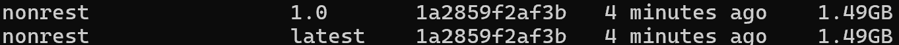

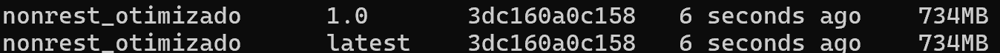

#### Criação de imagem para o projeto de Chat com docker

Para a criação da imagem pedida criou-se um ficheiro de extensão *Dockerfile* (mais propriamente *chatserver.Dockerfile*). Este ficheiro é semelhante ao anterior, mas contém as seguintes alterações para permitir a execução do servidor de *chat*:

```dockerfile
# Definir o diretório de trabalho como sendo a pasta gradle_basic_demo-main
WORKDIR /cogsi/CA2/gradle_basic_demo-main

# Porta que irá ser utilizada pela aplicação (apenas para documentação)
EXPOSE 59001

# Comando para executar a aplicação
CMD ["../gradlew", "runServer"]
```

Neste caso, foi definido o diretório de trabalho como a pasta correspondente ao projeto de *chat* e executou-se o servidor com o *gradlew*, através da tarefa *runServer*.

Utilizaram-se os seguintes comandos para gerar a imagem e executar um *container* tendo por base essa imagem, respetivamente:

```bash
docker build -f chatserver.Dockerfile --tag chatserver:1.0 --tag chatserver .
```

```bash
docker run -p 59001:59001 chatserver
```

Após o *container* ser iniciado, foi verificado que a sua execução ocorreu com sucesso:

1. Execução do cliente no *host*:

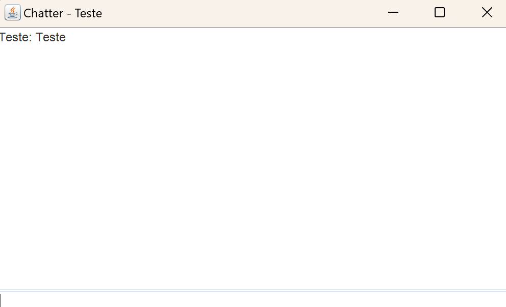

2. Execução do servidor:

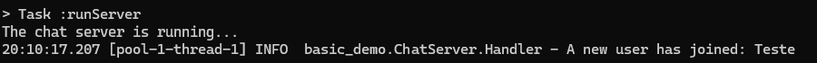

#### Diminuição do tamanho final da Imagem

Para reduzir o tamanho final da imagem, recorreu-se inicialmente ao comando abaixo, com o objetivo de analisar as diferentes camadas e comandos executados durante o processo de criação da imagem:

```bash
docker history chatserver
```

A partir do comando acima obteve-se o seguinte resultado:

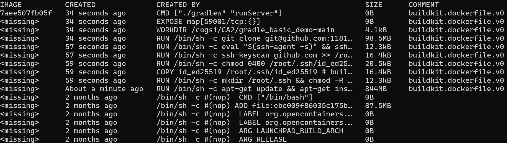

Da análise do resultado acima, é possível observar que a imagem gerada é muito semelhante à versão não otimizada do *nonrest*, e a explicação para o tamanho também segue a mesma linha. Tal como na primeira versão da imagem *nonrest*, o tamanho total é de aproximadamente 1,50 GB:

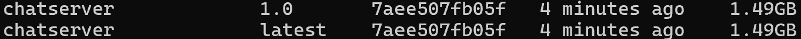As alterações efetuadas para diminuir o tamanho da imagem foram também semelhantes às alterações apresentadas anteriormente, utilizando-se o conceito de *Multi-stage builds*. Foram então realizadas as seguintes alterações de forma a implementar este conceito:

```dockerfile
WORKDIR /build/cogsi/CA2/gradle_basic_demo-main

# Construir o projeto usando o Gradle e gerar o JAR
RUN ./gradlew clean build

# Stage 2: Ambiente runtime
FROM openjdk:17-jdk-slim

# Copiar apenas o jar da imagem de build
COPY --from=builder /build/cogsi/CA2/gradle_basic_demo-main/build/libs/basic_demo-0.1.0.jar /gradle_basic_demo-main/basic_demo-0.1.0.jar

# Definir o diretório de trabalho
WORKDIR /gradle_basic_demo-main

# Expor a porta da aplicação
EXPOSE 59001

# Comando para iniciar a aplicação
CMD '["java", "-cp", "/gradle_basic_demo-main/basic_demo-0.1.0.jar", "basic_demo.ChatServerApp", "59001"]'
```

As principais diferenças para a otimização realizada na geração da imagem *nonrest* passam pelo diretório onde está localizada a aplicação, bem como no nome do *jar* executável gerado, sendo o restante processo semelhante. Com estas modificações, foi obtida uma imagem significativamente menor, com um tamanho aproximado de 645MB, como pode ser observado a partir das figuras abaixo:
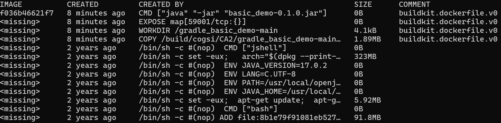

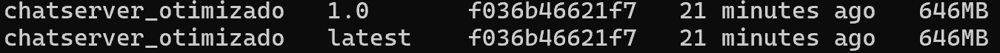

### Versão 2

#### Criação de imagem para o projeto Spring com docker

De forma a executar o projeto *spring* utilizando docker, foi necessário gerar um ficheiro *jar* capaz de executar todo o projeto isoladamente, sem dependências.
Para este fim foi ajustada a task "jar" no ficheiro build.gradle da seguinte forma:

```json
jar {
    manifest {
        attributes(
            'Main-Class': 'payroll.PayrollApplication'
        )
    }
}
```

Assim ao gerar o ficheiro *jar* não existirá necessidade de especificar a classe main.

As tasks `installDist` e `jar` são executadas para gerar o ficheiro *.jar* (especificamente, *nonrest.jar*). Este ficheiro é então colocado na raiz do projeto, juntamente com um *DockerFile*. Este *Dockerfile* tem o simples objetivo de instalar os pacotes necessários, copiar o ficheiro *.jar* gerado e executá-lo:

```dockerfile
# syntax=docker/dockerfile:1
FROM ubuntu:22.04

RUN apt-get update && apt-get install -y openjdk-17-jdk

COPY ./nonrest.jar /

CMD ["java", "-jar", "/nonrest.jar"]
```

- O comando `RUN` obtém a informação e realiza a instalação dos pacotes necessários para a execução do *.jar*;

- O comando `COPY` copia o ficheiro *.jar* para o diretório `/` do container;

- Finalmente o comando `CMD` executa o ficheiro *.jar*;

Após a configuração do *Dockerfile* foi executado o seguinte comando, no diretório onde esta está localizado:

```bash
docker build --tag tutrestjar .
```

Este realiza o *build* da imagem, com a *tag* escolhida (*tutrestjar*), indicando que o *Dockerfile* se localiza no diretório atual.

Após isto, foi executado o seguinte comando:

```bash
docker run -p 8080:8080 tutrestjar
```

Este comando corre o container com a *tag* indicada, sendo a flag **-p** utilizada para escolher um porto para ser *forwarded*. Neste caso foi escolhido o porto 8080 sendo forwarded para o porto 8080 do *host*. Com este porto sendo *forwarded* para o host, é possível aceder ao servidor através do http://localhost:8080/employees.

#### Criação de imagem para o projeto de Chat com docker

Na raiz do novo projeto para a utilização do docker foi criado um *Dockerfile* com o simples objetivo de instalar os pacotes necessários, copiar o ficheiro *.jar* gerado e executar o mesmo:

```dockerfile
# syntax=docker/dockerfile:1
FROM ubuntu:22.04

RUN apt-get update && apt-get install -y git curl vim openjdk-17-jdk

COPY ./basic_demo-0.1.0.jar /

CMD ["java", "-cp", "/basic_demo-0.1.0.jar", "basic_demo.ChatServerApp", "8080"]
```

O seu funcionamento é semelhante ao anterior, com a principal diferença no comando `CMD`. Neste caso, o comando `java -cp` é utilizado para especificar explicitamente a classe *ChatServerApp* como a classe principal da execução, sendo que o argumento `8080` refere-se ao porto a ser utilizado.

De seguida foi executado o seguinte comando:

```bash
docker build --tag chatserverjar .
```

Com a imagem gerada, é executado o *container* com o seguinte comando:

```bash
docker run -p 8080:8080 chatserverjar
```

Numa máquina cliente, é possível conectar a este servidor através do comando:

```bash
docker run -p 8080:8080 chatserverjar
```

### Otimização das imagens jar

De forma a otimizar estas imagens, foi escolhida a imagem `openjdk:17-jdk-slim`, imagem desenhada com o objetivo de minimizar o tamanho dos *containers*, apenas contendo o necessário para executar um projeto java com o *jdk-17*. Com esta imagem o tamanho de ambos os containers é reduzido significativamente:

```dockerfile
# syntax=docker/dockerfile:1
FROM openjdk:17-jdk-slim

COPY ./nonrest.jar /

CMD ["java", "-jar", "/nonrest.jar"]


# syntax=docker/dockerfile:1
FROM openjdk:17-jdk-slim

COPY ./basic_demo-0.1.0.jar /

CMD ["java", "-cp", "/basic_demo-0.1.0.jar", "basic_demo.ChatServerApp", "8080"]
```

Em ambas as implementações do *Dockerfile*, não é utilizado o processo de importar os pacotes *jdk* a partir do *unix*. Em vez disso, parte-se diretamente da cópia e execução do ficheiro *.jar* gerado: 

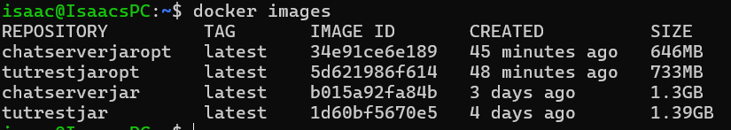

Na figura abaixo são apresentados os tamanhos das imagens originais e das novas imagens criadas utilizando a imagem *lightweight jdk* como base:

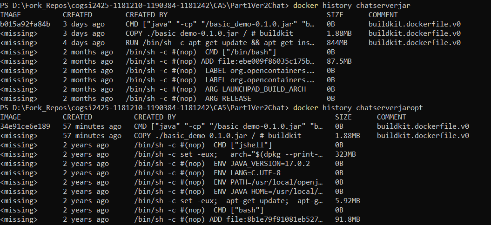

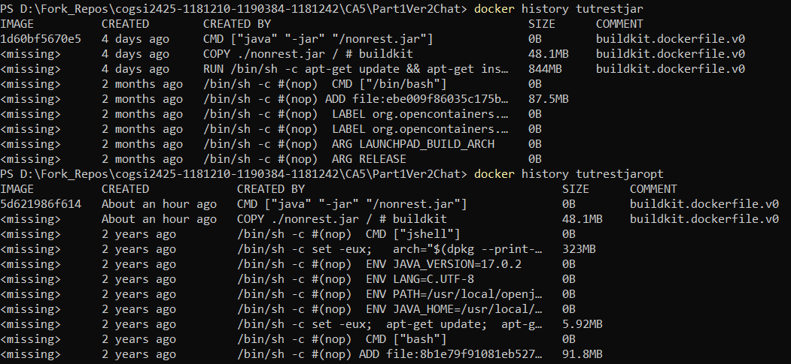

### Monitorização em tempo real dos Containers

Para monitorizar em tempo real os recursos que estão a ser consumidos pelos *containers* ativos, pode-se utilizar o seguinte comando:

```bash
docker stats
```

A partir deste comando é possível obter as informações pretendidas (tais como, o consumo do CPU, memória, entre outros). Na figura abaixo pode ser observado o consumo de recursos dos dois *containers* da versão 1 em tempo real:

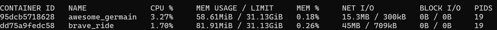

### Publicação das Imagens no Docker Hub

Para publicar as imagens no *Docker Hub*, foi realizada a autenticação na conta do *Docker* utilizando o seguinte comando:

```bash
docker login
```

Seguidamente, foram aplicadas as *tags* às imagens criadas, de forma a seguir o formato requisitado pelo *Docker Hub*: "username/repository:tag":

```bash
docker tag nonrest_otimizado david691691/nonrest_otimizado:1.0
```

Por fim, publicaram-se as imagens no *Docker Hub* através do seguinte comando:

```bash
docker push david691691/nonrest_otimizado:1.0
```

Este processo foi repetido para as diferentes imagens de ambas as versões.

## Parte 2

Nesta secção, foi solicitado o desenvolvimento de uma solução semelhante à implementada na CA3 - Parte 2. Para tal, foram criadas duas novas imagens: uma destinada a funcionar como servidor da base de dados *H2* e outra para atuar como servidor *tutRest*.

Estas imagens são geradas a partir de *Dockerfiles*, seguindo a mesma abordagem utilizada na Parte 1 deste trabalho. O conteúdo do *Dockerfile* responsável pela geração da imagem do *H2* é apresentado de seguida:

```dockerfile
# syntax=docker/dockerfile:1
FROM ubuntu:22.04

# Instalar as dependências
RUN apt-get update && apt-get install -y git curl vim openjdk-17-jdk netcat net-tools

# Criar uma pasta .ssh na home do utilizador root
RUN mkdir /root/.ssh && chmod -R 700 /root/.ssh

# Copiar a chave privada da pasta .ssh do host para a imagem
COPY id_ed25519 /root/.ssh/id_ed25519

# Alteração de permissões e configurações do ssh
RUN chmod 0400 /root/.ssh/id_ed25519 && echo "StrictHostKeyChecking no" > /root/.ssh/config

# Adicionar o github aos 'known_hosts'
RUN ssh-keyscan github.com >> /root/.ssh/known_hosts

RUN eval "$(ssh-agent -s)" && ssh-add /root/.ssh/id_ed25519

# Realizar o clone do repositório
RUN git clone git@github.com:1181210/cogsi2425-1181210-1190384-1181242.git cogsi

WORKDIR /cogsi/CA2/tutRestGradle/nonrest

# Porta que irá ser utilizada pela aplicação (apenas para documentação)
EXPOSE 9092

# Comando para executar a base de dados
CMD ["../gradlew", "startH2Server"]
```

Este ficheiro é bastante semelhante aos apresentados na Parte 1, com duas diferenças principais: a instalação do pacote *netcat*, que permite verificar se o porto 9092 da base de dados está a aceitar comunicações (funcionalidade útil para uma etapa posterior do trabalho), e a utilização do *Gradle* para executar a tarefa *startH2Server*, responsável pela inicialização da base de dados.

O *Dockerfile* que gera a imagem utilizada pelo *container* *web* é similar ao mencionado anteriormente, com a diferença de que, neste caso, executa a tarefa *bootRun*:

```dockerfile
# Porta que irá ser utilizada pela aplicação (apenas para documentação)
EXPOSE 8000

# Comando para executar a base de dados
CMD ["../gradlew", "bootRun"]
```

Após a criação dos *Dockerfiles* mencionados, as imagens foram geradas utilizando o comando *docker build*, conforme demonstrado abaixo:

```bash
docker build -f db.Dockerfile --tag db:1.0 --tag db:latest .
docker build -f web.Dockerfile --tag web:1.0 --tag web:latest .
```

Após a geração das imagens, foi criado um ficheiro `compose.yaml` com o objetivo de configurar os serviços necessários para as aplicações solicitadas (*web* e *db*). O conteúdo deste ficheiro é apresentado a seguir:

```yaml
networks:
  custom_network:
    driver: bridge
    ipam:
      config:
        - subnet: 192.168.33.0/24 

services:
  db:
    image: db
    volumes:
      - ./shared:/shared
    networks:
      custom_network:
        ipv4_address: 192.168.33.11
    ports:
      - "9092:9092"
    environment:
      H2_BASE_DIR: /shared
      H2_TCP_PORT: 9092
      H2_TCP_ALLOW_OTHERS: true
    healthcheck:
      test: ["CMD", "nc", "-zv", "127.0.0.1", "9092"]
      interval: 20s
      timeout: 10s
      retries: 5
      start_period: 120s

  web:
    image: web
    networks:
      custom_network:
        ipv4_address: 192.168.33.10
    ports:
      - "8000:8080"
    environment:
      SPRING_DATASOURCE_URL: jdbc:h2:tcp://192.168.33.11:9092/shared
      SPRING_DATASOURCE_USERNAME: admin
      SPRING_DATASOURCE_PASSWORD: adminpassword
      SPRING_JPA_HIBERNATE_DDL_AUTO: update
    healthcheck:
      test: ["CMD", "curl", "-f", "http://localhost:8080/employees"]
      interval: 15s
      timeout: 10s
      retries: 5
      start_period: 50s
    depends_on:
      db:
        condition: service_healthy
```

Como se pode observar pelo ficheiro acima, o mesmo configura os dois serviços pedidos (*web* e *db*). Para além disso, é configurada uma rede que permite a comunicação entre os dois *containers*, são configuradas variáveis de ambiente para ambos os serviços, e é garantido que a comunicação entre estes funcione corretamente. Por fim, inclui-se a persistência dos dados no *container* *db* através de um volume. 

### Configuração da Rede

Começou-se por criar uma rede personalizada (chamda *custom_network*) de forma a garantir que os serviços pudessem comunicar diretamente entre si. Para tal, utilizou-se o *driver* `bridge` (que é o *default* e é útil quando os *containers* estão alojados no mesmo *host* e necessitam de comunicar entre si). Poderia ter sido utilizado o *driver* *host* de forma a remover o isolamento entre estes e o *host*, porém essa abordagem não foi necessária para o trabalho em questão. A *subnet* configurada (192.168.33.0/24) garante que os IPs atribuídos sejam estáticos, facilitando a comunicação entre os *containers* e os *health checks* pedidos.

### Serviço db (Base de Dados)

Para este serviço:

1. Começa-se por especificar a imagem "db" que é a imagem a partir do qual o *container* será inicializado;

2. Na secção *networks*, define-se o endereço de IP estático 192.168.33.11 (proveniente da rede *custom_network*);

3. Especifica-se o *port forwarding*, mapeando-se o porto 9092 do *container* para o porto 9092 do *host*;

#### Utilização do volume no container db

Este *container* é configurado para utilizar um volume que mapeia a pasta `./shared` do *host* para a pasta `shared` do *container*, garantindo que os dados da base de dados sejam persistidos fora deste e permitindo que sejam recuperados mesmo após a remoção ou reinicialização do mesmo. 

#### Utilização de variáveis de ambiente para configurar a db

O serviço `db` define algumas variáveis de ambiente essenciais para configurar o comportamento do H2: 

- O diretório de base de dados (`H2_BASE_DIR`);

- O porto TCP utilizado para conexões (`H2_TCP_PORT`);

- Uma permissão para permitir que outros *containers* (neste caso o *container* *web*) se contectem à base de dados (`H2_TCP_ALLOW_OTHERS`);

#### Testar a rede entre os serviços

Para garantir que o serviço `db` esteja operacional antes de permitir que o serviço `web` se conecte a ele, é configurado um *health check* que executa o comando `nc -zv 127.0.0.1 9092` para verificar se a porta 9092 está aberta e acessível. Este teste é repetido a cada 20 segundos, com um tempo limite de 10 segundos para cada tentativa, permitindo até 5 tentativas no total, e inclui um período inicial de 120 segundos para garantir que o serviço tenha tempo suficiente para iniciar.

### Serviço web (nonrest)

 Para este serviço:

1. Começa-se por especificar a imagem "web" que é a imagem a partir do qual o *container* será inicializado;

2. Na secção *networks*, define-se o endereço de IP estático 192.168.33.10 (proveniente da rede *custom_network*);

3. Especifica-se o *port forwarding*, mapeando-se o porto 8080 do *container* para o porto 8000 do *host*;

#### Utilização de variáveis de ambiente para configurar o serviço web

As variáveis de ambiente para o serviço `web` são configuradas para garantir que a aplicação consiga se conectar à base de dados H2 definida anteriormente: 

- O URL de conexão com a base de dados (`SPRING_DATASOURCE_URL`) - este aponta para o IP do serviço `db` (`jdbc:h2:tcp://192.168.33.11:9092/shared`);

- As credenciais de acesso à base de dados (`SPRING_DATASOURCE_USERNAME` e `SPRING_DATASOURCE_PASSWORD`);

- Atualização automática do *schema* da base de dados (`SPRING_JPA_HIBERNATE_DDL_AUTO`);

A informação sensível, como o *username* e *password* da base de dados, **não** deve ser passada diretamente no ficheiro *compose*, uma vez que ficaria visível para todos. Esta abordagem foi realizada dado que se está perante um ambiente de desenvolvimento. Caso fosse utilizado um ambiente de produção seria recomendada a utilização dos *secrets*, garantindo-se uma maior segurança.

Para que isto tivesse sucesso, foi alterado o ficheiro *application.properties* para que utiliza-se variáveis:

```properties
spring.datasource.url=${SPRING_DATASOURCE_URL}
spring.datasource.driverClassName=org.h2.Driver
spring.datasource.username=${SPRING_DATASOURCE_USERNAME}
spring.datasource.password=${SPRING_DATASOURCE_PASSWORD}
spring.jpa.defer-datasource-initialization=true
spring.jpa.generate-ddl=true
spring.jpa.hibernate.ddl-auto=${SPRING_JPA_HIBERNATE_DDL_AUTO}
```

#### Testar a rede entre os serviços

Para o serviço `web` também foi configurado um *health check*. Este realiza um pedido HTTP ao endereço `/employees`  (*localhost*) para garantir o correto funcionamento da aplicação. O teste é executado a cada 15 segundos, com um tempo limite de 10 segundos para cada tentativa, com um máximo de 5 tentativas e um período inicial de 50 segundos para garantir que a aplicação tenha tempo para inicializar.

Por fim, o serviço `web` depende do serviço `db`, o que significa que o serviço `web` só será iniciado após o serviço `db` ser considerado "saudável". Isto é garantido pela opção `depends_on`, que espera que o serviço `db` passe no *health check* antes de permitir o início do serviço `web`.

### Publicação das imagens *web* e *db* no Docker Hub

Para publicar as imagens no *Docker Hub*, seguiu-se a mesma abordagem mencionada na parte 1, tendo-se executado os seguintes comandos: 

#### DB:

```bash
docker tag db david691691/db:1.0
docker push david691691/db:1.0
```

#### Web:

```bash
docker tag web david691691/web:1.0
docker push david691691/web:1.0
```

## Solução alternativa ao Docker

Nesta secção é detalhada uma solução alternativa ao Docker, utilizando o **Podman**, o **Buildah** e o **Kubernetes**. Estas ferramentas modernas oferecem uma abordagem eficiente e sem dependência de um daemon central para a gestão de containers, além de um sistema avançado de configuração de aplicações. Juntas, garantem maior segurança, flexibilidade e escalabilidade em ambientes containerizados.

### Introdução ao Podman

O Podman é uma alternativa ao Docker que se destaca pela sua abordagem sem daemon central, garantindo maior segurança e simplicidade para a gestão de containers. Com suporte a comandos compatíveis com Docker e funcionalidades como **rootless containers**, o Podman é uma escolha robusta para ambientes modernos que priorizam segurança e flexibilidade.

#### Como é que o Podman funciona?

O Podman gere containers e imagens de forma semelhante ao Docker, mas elimina a necessidade de um daemon central. Isso significa que os containers podem ser executados como processos individuais, tornando a ferramenta mais segura e eficiente em cenários que requerem maior controlo do sistema operacional.

O Podman possui componentes principais que permitem a criação e gestão de ambientes containerizados:

1. **Containerfiles**:
   
   - Equivalentes aos Dockerfiles, os Containerfiles definem o ambiente de execução e as instruções para configurar e instalar software nos containers.

2. **Imagens e Containers**:
   
   - Imagens criadas com o Podman podem ser armazenadas localmente ou em repositórios como Docker Hub ou Quay.io. Cada imagem pode ser usada para criar containers isolados.

3. **Volumes**:
   
   - Assim como no Docker, volumes são usados para persistir dados fora do ciclo de vida dos containers. No CA5, volumes podem ser usados para armazenar dados da base de dados H2.

4. **Rede no Podman**:
   
   - O Podman permite configurar redes privadas entre containers, possibilitando que serviços como um servidor web e uma base de dados comuniquem de forma eficiente.

5. **Podman Compose**:
   
   - Com a ajuda do Podman Compose (compatível com Docker Compose), é possível gerir múltiplos serviços de forma conjunta, utilizando um único ficheiro de configuração.

---

#### Processo de execução do Podman

O fluxo de execução no Podman segue etapas similares às do Docker:

1. **Criação do Containerfile**: 
   
   - Para cada serviço (ex.: servidor REST ou base de dados), criamos um Containerfile que define as configurações da aplicação.

2. **Construção da Imagem**:
   
   - Utilizamos o comando `podman build` para gerar imagens baseadas nos Containerfiles.

3. **Execução do Container**:
   
   - Iniciamos os containers com `podman run`, garantindo que sejam executados em ambientes isolados.

4. **Definição do Podman Compose**:
   
   - Configuranis o ficheiro `podman-compose.yml` para definir os serviços, volumes e redes, permitindo a gestão de todo o ambiente com um único comando.

---

#### Vantagens do Podman

1. **Sem Daemon (Daemonless):** A ausência de um daemon central reduz riscos de segurança e permite que containers sejam executados como processos normais.

2. **Segurança Rootless:** Permite que containers sejam executados sem privilégios de root, aumentando a segurança em ambientes multiutilizador.

3. **Compatibilidade com Docker:** A maioria dos comandos e conceitos do Docker funcionam no Podman, tornando a transição simples.

4. **Flexibilidade:** Permite gerir pods (grupos de containers que partilham recursos) de forma nativa, facilitando a organização de serviços interdependentes.

5. **Ecosistema em Crescimento:** Com suporte a repositórios como Docker Hub, Quay.io e outros, o Podman oferece integração ampla com ferramentas de containerização.

---

### Introdução ao Buildah e Kubernetes

O **Buildah** é uma ferramenta especializada na construção de imagens de containers, oferecendo uma abordagem minimalista e sem dependência de um daemon central. Combinado ao **Kubernetes**, a plataforma líder em gestão de containers, forma uma solução poderosa e altamente escalável para criação e gestão de ambientes containerizados. Essa integração é ideal para ambientes que requerem alta flexibilidade e escalabilidade na gestão de aplicações.

---

#### Como é que o Buildah e o Kubernetes funcionam?

##### **Buildah**

O Buildah foca exclusivamente na criação de imagens de containers. Oferece flexibilidade para construir imagens diretamente a partir de Containerfiles (ou mesmo sem eles) e suporta uma abordagem sem daemon, garantindo segurança e eficiência.

**Características principais do Buildah:**

1. **Construção de Imagens**: 
   - Permite criar imagens usando comandos interativos ou scripts, sem a necessidade de executar um container.

2. **Compatibilidade com OCI/Docker**: 
   - As imagens geradas são compatíveis com os padrões OCI (Open Container Initiative) e Docker, possibilitando a sua utilização em qualquer runtime que siga esses padrões, incluindo o Kubernetes.

3. **Execução Rootless**: 
   - Assim como o Podman, o Buildah pode ser executado sem privilégios de root, aumentando a segurança.

##### **Kubernetes**

O Kubernetes é uma plataforma de configuração de containers que automatiza a implantação, escalonamento e gestão de aplicações em ambientes distribuídos.

**Características principais do Kubernetes:**

1. **Pods**: 
   - Unidades básicas de execução que podem conter um ou mais containers. Representam processos isolados.

2. **Deployments**: 
   - Controlam a criação e atualização dos pods, garantindo a disponibilidade e o escalonamento automático.

3. **Serviços (Services)**: 
   - Facilitam a comunicação entre pods e utilizadores, garantindo o balanceamento de carga.

4. **Volumes**: 
   - Armazenamento persistente para dados partilhados ou armazenados fora do ciclo de vida dos pods.

5. **ConfigMaps e Secrets**: 
   - Gerem configurações e credenciais sensíveis de maneira centralizada.

---

#### Processo de Utilização do Buildah e Kubernetes

##### **Com Buildah: Construção de Imagens**

1. **Criação do Containerfile**:
   - Define os comandos e configurações para a construção da imagem de cada serviço.

2. **Construção da Imagem**:
   - Utilizamos o comando `buildah bud -f Containerfile -t nome_da_imagem` para construir a imagem localmente.

3. **Armazenamento e Push**:
   - As imagens podem ser enviadas para repositórios como Docker Hub ou Quay.io usando `buildah push`, tornando-as disponíveis para o Kubernetes.

##### **Com Kubernetes: Configuração e Execução**

1. **Criação do Manifesto Kubernetes**:
   - Criamos arquivos YAML que definem recursos como Deployments, Services, e ConfigMaps.

2. **Aplicação no Cluster**:
   - Utilizamos o comando `kubectl apply -f manifesto.yaml` para implantar os serviços no cluster Kubernetes.

3. **Gestão Contínua**:
   - O Kubernetes gere automaticamente os pods, balanceando carga e reiniciando containers em caso de falhas.

---

#### Benefícios do Buildah e Kubernetes

##### **Vantagens do Buildah**

1. **Flexibilidade no Build**:
   - Permite construir imagens sem precisar de um daemon central, utilizando qualquer base existente ou partindo do zero.

2. **Segurança Rootless**:
   - A construção rootless minimiza riscos de segurança, especialmente em ambientes partilhados.

3. **Compatibilidade com OCI**:
   - Suporte total aos padrões abertos garante interoperabilidade com diversas plataformas.

4. **Leveza**:
   - Por não incluir funcionalidades de execução de containers, o Buildah é extremamente leve e focado.

##### **Vantagens do Kubernetes**

1. **Escalabilidade Automática**:
   - Escala automaticamente os pods com base na demanda, otimizando recursos.

2. **Resiliência e Recuperação**:
   - Reinicia automaticamente os pods em caso de falhas, garantindo alta disponibilidade.

3. **Gestão de Ambientes Complexos**:
   - Suporte a deploys distribuídos, com balanceamento de carga e redes internas robustas.

4. **Ecosistema Amplo**:
   - Integra-se com ferramentas modernas de CI/CD e armazenamento, como Helm, Prometheus e volumes persistentes.

5. **Portabilidade**:
   - Clusters podem ser configurados on-premises, em nuvens públicas ou híbridas, adaptando-se a qualquer ambiente.

---

#### Fluxo Geral de Implementação com Buildah e Kubernetes

1. **Definir o Containerfile** para cada serviço da aplicação.
2. **Construir as imagens** localmente com o Buildah e enviá-las para um registo.
3. Criar **manifestos Kubernetes** para descrever a infraestrutura desejada.
4. Usar o `kubectl` para aplicar os manifestos no cluster.
5. Gerir e monitorizar a aplicação com as ferramentas do Kubernetes, garantindo alta disponibilidade e escalabilidade.

---

### Considerações Finais

A combinação do **Buildah** com o **Kubernetes** oferece uma solução moderna e eficiente para a criação e configuração de containers. Enquanto o Buildah é ideal para construção de imagens de forma segura e sem overhead, o Kubernetes garante a execução confiável e escalável de aplicações em produção.

### Em Comparação com Docker e outras ferramentas

| **Fator de Comparação**        | **Docker**                                                                   | **Podman**                                                          | **Kubernetes**                                                               | **LXC/LXD**                                                               |
| ------------------------------ | ---------------------------------------------------------------------------- | ------------------------------------------------------------------- | ---------------------------------------------------------------------------- | ------------------------------------------------------------------------- |
| **Linguagem**                  | Dockerfile/YAML                                                              | Containerfile/YAML                                                  | YAML                                                                         | LXC Configs                                                               |
| **Performance**                | Rápida, desenhado para ambientes pequenos                                    | Rápida, sem necessidade de daemon, adequada para ambientes pequenos | Média, projetada para gerir ambientes de grande escala de forma eficiente    | Rápida, eficiente para containers leves e sistemas operacionais completos |
| **Segurança**                  | Baseada em namespaces e cgroups, mas requer configuração extra para rootless | Sem daemon, oferece segurança nativa com containers rootless        | Implementa autenticação robusta, ideal para ambientes empresariais           | Isolamento forte com namespaces, próximo ao nível de máquinas virtuais    |
| **Complexidade de Instalação** | Simples, basta instalar o Docker Engine                                      | Simples, pode funcionar sem daemon                                  | Alta, necessita de configuração de clusters e nodes                          | Média, exige configuração manual detalhada                                |
| **Orquestração**               | Docker Compose para ambientes simples                                        | Podman Compose, funcionalidade similar ao Docker Compose            | Avançada, ideal para clusters e sistemas distribuídos                        | Básica, limitada a funcionalidades de rede e volumes                      |
| **Persistência**               | Volumes Docker para armazenamento de dados                                   | Volumes Podman                                                      | Persistent Volumes (PVCs), integra-se com diversos sistemas de armazenamento | Volumes manuais ou automáticos para persistência                          |
| **Escalabilidade**             | Moderada, atende a aplicações pequenas e médias                              | Moderada, voltada para ambientes locais e menos complexos           | Alta, projetada para grandes clusters com suporte a autoescalabilidade       | Baixa, adequado para ambientes específicos e isolados                     |
| **Comunidade e Suporte**       | Ampla, com vasto ecossistema e documentação                                  | Boa, mas menos abrangente que o Docker                              | Muito ampla, com suporte empresarial e contribuições da indústria            | Limitada, mas atende bem a casos específicos ou altamente especializados. |

---

## Implementação do CA5 com o Buildah, Podman e o Kubernetes

A solução pensada inicialmente foi utilizar o **Podman** para implementar a alternativa ao *Docker*. No entanto, reparamos  que apesar do **Podman** ter algumas diferenças, como por exemplo, o facto de ser *Daemonless* e os seus comandos serem diferentes, este suporta a utilização de *DockerFiles* e de *compose.yaml*. Isto significa que a implementação da alternativa com esta ferramenta iria apenas consistir em modificar os comandos utilizados para a geração e execução das imagens. Para contornar este facto, implementou-se a solução alternativa recorrendo-se a três ferramentas distintas: uma que permite gerar imagens com outra sintaxe, o **Buildah**, outra que permite executar as imagens, o **Podman** e outra que permite a definição e execução de múltiplos *containers* (também com uma sintaxe diferente), o **Kubernetes**.

### Instalação do Buildah

Para instalar a ferramenta *buildah* executou-se o seguinte comando no *WSL* (dado que esta ferramenta não é suportada diretamente em sistemas *Windows*):

```bash
sudo apt-get -y install buildah
```

### Instalação do Podman

Para instalar a ferramenta *podman* utilizou-se o seguinte comando no *WSL*:

```bash
 sudo apt -y install podman
```

### Instalação do Kubernetes

Para instalar o *kubernetes* no *wsl* foi necessário instalar algumas ferramentas:

1. Como é necessário possuir um *container kubernets* em execução, utilizou-se o *Minikube* no ambiente local do *wsl*. Para instalar o *Minikube* executaram-se os seguintes comandos:
   
   ```bash
   sudo apt install -y conntrack
   curl -LO https://storage.googleapis.com/minikube/releases/latest/minikube-linux-amd64
   sudo mv minikube-linux-amd64 /usr/local/bin/minikube
   sudo chmod +x /usr/local/bin/minikube
   ```

2. De seguida, instalou-se o *kubectl* (que é uma ferramenta de linha de comandos que permite gerir objetos e *clusters Kubernetes*):
   
   ```bash
   curl -LO "https://dl.k8s.io/release/$(curl -L -s https://dl.k8s.io/release/stable.txt)/bin/linux/amd64/kubectl"
   chmod +x kubectl
   sudo mv kubectl /usr/local/bin/
   ```

3. Para inicializar o *Cluster Minikube* executou-se o seguinte comando:
   
   ```bash
   minikube start --driver=none
   ```

#### Parte 2

##### Geração das imagens Web e DB com o Buildah

Para gerar as imagens com o Buildah foi criado um script *bash* com o seguinte conteúdo para a geração da imagem *db*:

```bash
#!/bin/bash

# Criar um novo container tendo por base uma imagem "Ubuntu"
container_name="db"
base_image="ubuntu:22.04"
buildah from --name $container_name $base_image

# Atualizar a lista de pacotes e instalar as ferramentas necessárias
buildah run $container_name apt-get update
buildah run $container_name apt-get install -y openssh-client git openjdk-17-jdk curl

# Criar o diretório .ssh para o utilizador root
buildah run $container_name mkdir -p /root/.ssh

# Copiar a chave privada SSH para o Container
buildah copy $container_name ~/.ssh/id_ed25519 /root/.ssh/id_rsa

# Criar o ficheiro de configuração do SSH para o GitHub
buildah run $container_name sh -c 'echo "Host github.com\n\tStrictHostKeyChecking no\n\tUserKnownHostsFile=/dev/null" > /root/.ssh/config'

# Definir as permissões corretas para os ficheiros SSH
buildah run $container_name chmod 700 /root/.ssh
buildah run $container_name chmod 600 /root/.ssh/id_rsa
buildah run $container_name chmod 600 /root/.ssh/config

# Clonar o repositório
repo_url="git@github.com:1181210/cogsi2425-1181210-1190384-1181242.git"
clone_path="/root/cogsi"
buildah run $container_name git clone $repo_url $clone_path

# Definir o diretório base como sendo a pasta nonrest
buildah config --workingdir /root/cogsi/CA2/tutRestGradle/nonrest $container_name

# Expor a porta 9092 - para documentação
buildah config --expose 9092 $container_name

# Configurar o comando de inicialização dos container gerados a partir desta imagem
buildah config --cmd "../gradlew startH2Server" $container_name

# Exportar a imagem para o repositório
image_name="db_buildah:1.0"
buildah commit $container_name $image_name

buildah tag db_buildah:1.0 db_buildah:latest
```

O primeiro comando do ficheiro permite criar uma nova imagem com base na imagem *ubuntu:22.04*, utilizando-se o comando `buildah from`.

De seguida (e dentro do *container*) executa-se (através do comando `run` e passando por argumento o nome escolhido para o *container*) um conjunto de passos para instalar os pacotes necessários, configurar o *ssh*, realizar o *clone* do repositório, configurar o diretório atual e o comando de execução dos *containers* "levantados" a partir da imagem. Este processo não é detalhado dado que é muito semelhante aos *Dockerfiles* já explicados na parte 2. Por fim, utiliza-se o comando `buildah commit $container_name $image_name` para gerar uma nova imagem a partir deste *container* em execução, com o nome *db*.  

As imagens geradas são armazenadas na base de dados local de imagens do *Buildah* (e não num diretório em específico como no *Docker*), sendo estas geridas internamente. Após gerada a imagem, a mesma pode ser observada no repositório da ferramenta a partir do seguinte comando:

```bash
buildah images
```

Ao executar este comando, obtém-se o seguinte resultado:

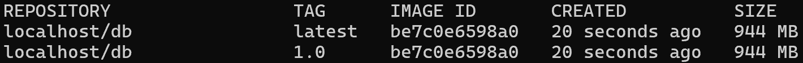

É possível exportar a imagem para um determinado ficheiro, utilizando-se o seguinte comando:

```bash
buildah push web oci-archive:/caminho/db.tar
```

Depois de exportada, é possível carregar esta imagem noutro sistema, através do comando:

```bash
buildah load -i /caminho/db.tar
```

A geração da imagem *web* é semelhante à imagem *db*, alterando-se apenas o comando de execução para *bootRun* de forma a inicializar o servidor *web*. 

##### Nota

Pode-se observar que a ferramenta tem uma enorme desvantagem em relação ao *Docker*, dado que as imagens são geradas mesmo que erros ocorram durante os passos de execução (o ficheiro executado é um *script* que executa uma sequência de comandos). Com isto, é necessário tratar os erros antes de gerar a imagem para que imagens inconsistentes não sejam geradas.

##### Executar Containers a Partir das Imagens Buildah

Para levantar *containers* a partir destas imagens poderia ser utilizada a ferramenta *podman* já explicada anteriormente:

```bash
podman run -d -p 8000:8080 --name web web
podman run -d -p 9092:9092 --name db db
```

Este comando é muito semelhante ao utilizado para iniciar *containers* a partir de imagens *Docker*. O argumento `-d` tem como objetivo executar o *container* em segundo plano (*background*), enquanto o argumento `-p` realiza o encaminhamento de portas (*port forwarding*), no formato "porto_host:porto_container". Os dois argumentos seguintes especificam, respetivamente, o nome da imagem a partir da qual se pretende iniciar o *container* e o nome que se deseja atribuir ao próprio *container*.

##### Publicação das imagens *web* e *db* no Docker Hub

Foi possível publicar as imagens criadas (*db* e *web*) com o *buildah* no *docker hub* recorrendo-se também à ferramenta do *Podman*. Para isso executaram-se os seguintes comandos:

###### DB:

```bash
podman tag db_buildah:1.0 david691691/db_buildah:1.0
podman push david691691/db_buildah:1.0
```

###### Web:

```bash
podman tag db_buildah:1.0 david691691/web_buildah:1.0
podman push david691691/web_buildah:1.0
```

É possível notar que o processo é muito semelhante ao já demonstrado nas partes 1 e 2 deste trabalho.

##### Criação dos Containers

Para a criação dos *containers*, foi utilizada a ferramenta *Kubernetes*, semelhante ao que foi realizado anteriormente com o *Docker Compose*. Para tal, foi desenvolvido um ficheiro de configuração no formato YAML (*deployment.yml*) contendo as especificações necessárias. O conteúdo desde ficheiro é apresentado de seguida:

```yml
apiVersion: apps/v1
kind: Deployment
metadata:
  name: db
spec:
  replicas: 1
  selector:
    matchLabels:
      app: db
  template:
    metadata:
      labels:
        app: db
    spec:
      containers:
      - name: db
        image: docker.io/david691691/db_buildah:1.0
        ports:
        - containerPort: 9092
        volumeMounts:
        - name: host-shared-volume
          mountPath: /shared
        env:
        - name: H2_BASE_DIR
          value: /shared
        - name: H2_TCP_PORT
          value: "9092"
        - name: H2_TCP_ALLOW_OTHERS
          value: "true"
        livenessProbe:
          tcpSocket:
            port: 9092
          initialDelaySeconds: 180
          periodSeconds: 20
          timeoutSeconds: 10
          failureThreshold: 5
        readinessProbe:
          tcpSocket:
            port: 9092
          initialDelaySeconds: 150
          periodSeconds: 20
          timeoutSeconds: 10
          failureThreshold: 5
      volumes:
      - name: host-shared-volume
        hostPath:
          path: /home/david/shared
          type: DirectoryOrCreate  # Cria o diretório caso ele não exista

---
apiVersion: apps/v1
kind: Deployment
metadata:
  name: web
spec:
  replicas: 1
  selector:
    matchLabels:
      app: web
  template:
    metadata:
      labels:
        app: web
    spec:
      containers:
      - name: web
        image: docker.io/david691691/web_buildah:1.0
        ports:
        - containerPort: 8080
        env:
        - name: SPRING_DATASOURCE_URL
          value: "jdbc:h2:tcp://db:9092/shared"
        - name: SPRING_DATASOURCE_USERNAME
          value: "admin"
        - name: SPRING_DATASOURCE_PASSWORD
          value: "adminpassword"
        - name: SPRING_JPA_HIBERNATE_DDL_AUTO
          value: "update"
        readinessProbe:
          httpGet:
            path: /employees
            port: 8080
          initialDelaySeconds: 120 
          periodSeconds: 30
          timeoutSeconds: 10
          failureThreshold: 5
        livenessProbe:
          httpGet:
            path: /employees
            port: 8080
          initialDelaySeconds: 120
          periodSeconds: 30
          timeoutSeconds: 10
          failureThreshold: 5
```

Este ficheiro configura os dois serviços pedidos (*web* e *db*) utilizando as imagens publicadas anteriormente no *Docker Hub*. Para além disso, incorpora diversos conceitos característicos do *Kubernetes*, incluindo:

- **apiVersion: apps/v1:** define a versão da API do *kubernetes* para o tipo *Deployment*, sendo a versão utilizada a mais comum para este tipo de objetos;

- **kind: Deployment:** define que é um objeto do tipo *Deployment*, que controla a gestão do ciclo de vida dos *pods*;

- **metadata:** permite definir informações sobre o *Deployment*, como por exemplo, **name: db** que define o nome do *Deployment*, sendo útil para identificá-lo no *cluster*;

- **spec**: permite especificar configurações do *Deployment*, tendo:
  
  - **metadata:** define as *labels* do *pod*;
  
  - **spec:** define as configurações do *pod*, tais como o nome, a imagem (neste caso está-se a obter a imagem a partir do *Docker Hub*), entre outras configurações que serão explicadas de seguida;

##### Serviço db (Base de Dados)

Para este serviço:

1. Começa-se por especificar a imagem "db_buildah" que é a imagem a partir do qual o *container* será inicializado;

2. O nome que terá o *container* (`-name: db`);

3. O *port forwarding*, mapeando-se o porto 9092 do *container* para o porto 9092 do *host* (`containerPort: 9092`);

###### Utilização do volume no container db

Este *container* é configurado para utilizar um volume que mapeia a pasta `./shared` do *host* para a pasta `shared` do *container*, garantindo que os dados da base de dados sejam persistidos fora deste e permitindo que sejam recuperados mesmo após a remoção ou reinicialização do mesmo. 

Esta funcionalidade é definida através do argumento `volumeMounts`, que monta o volume com o nome *host-shared-volume* no diretório `/shared` do *container*. O parâmetro `mountPath: /shared` especifica o local dentro do *container* onde o volume será montado.

Na seção `volumes`, é especificado o volume que será disponibilizado para o *container*. Aqui, foi utilizado um volume do tipo `hostPath`, que permite compartilhar um diretório específico do *host*. O campo `path` define o caminho da pasta a ser compartilhada no *host*, enquanto o parametro `type: DirectoryOrCreate` assegura que o diretório será criado automaticamente no *host* caso não exista.

###### Utilização de variáveis de ambiente para configurar a db

O serviço `db` define algumas variáveis de ambiente essenciais para configurar o comportamento do H2. Estas variáveis são definidas na secção `env`:

- O diretório de base de dados (`H2_BASE_DIR`);

- O porto TCP utilizado para conexões (`H2_TCP_PORT`);

- Uma permissão para permitir que outros *containers* (neste caso o *container* *web*) se contectem à base de dados (`H2_TCP_ALLOW_OTHERS`);

###### Testar a rede entre os serviços

Para garantir que o serviço `db` esteja operacional antes de permitir que o serviço `web` se conecte a ele, são configuradas duas *Probes*. As *Probes* são mecanismos utilizados para monitorizar a "saúde" e a disponibilidade dos *containers* em execução.

A *livenessProbe* tem como objetivo determinar se o *container* está a funcionar corretamente. Caso esta falhe o *container* é considerado "não saudável" e é reiniciado.   Este conceito é semelhante ao conceito *healthCheck* do *Docker*, definindo-se o *initialDelaySeconds* (conceito semelhante ao *start_period* do *Docker*), o *periodSeconds* (*interval* no *Docker*), o *timeoutSeconds* (*timeout* no *Docker*) e o *failureThreshold* (*retries* do *Docker*).

A *readinessProbe* tem como objetivo verificar se o *container* está pronto para receber comunicações/conexões. Caso esta verificação falhe, o *kubernetes* não encaminha tráfego para o *container* até que ele esteja num estado considerado "pronto", garantindo então que o *container web* só envie comunicações quando este estiver totalmente operacional. Os parâmetros deste *probe* são semelhantes ao *probe* explicado anteriormente.

##### Serviço web (nonrest)

Para este serviço:

- Começa-se por especificar a imagem "web_buildah" que é a imagem a partir do qual o *container* será inicializado;

- O nome que terá o *container* (`-name: web`);

- O *port forwarding*, mapeando-se o porto 8080 do *container* para o porto 8080 do *host* (`containerPort: 8080`);

###### Utilização de variáveis de ambiente para configurar o serviço web

As variáveis de ambiente para o serviço `web` são configuradas para garantir que a aplicação se consiga conectar à base de dados H2 definida anteriormente, sendo definidas na seção `env`. A principal diferença entre estas variáveis e as definidas na parte 2 é a variável `SPRING_DATASOURCE_URL`, na qual se especifica o *hostname* do *container* (bd) em vez do endereço de IP. Este é um recurso do Kubernetes, pois o *hostname* é resolvido automaticamente pelo DNS interno do *cluster*, não existindo a necessidade de configurar uma rede estática.

#### Parte 1

Alguns dos pontos pedidos na parte 1 do trabalho já foram sendo explicados ao longo da parte 2, tais como a geração das imagens, a realização das *tags* das imagens geradas, a sua publicação no *Docker Hub*, o *port forwarding* e o respetivo acesso das aplicações a partir do *host*.

**Nota:** todos os ficheiros de configuração (de todas as versões/partes) podem ser observados no diretório **alternative_solution** do repositório.

##### Versão 1

Em relação à versão 1, o processo é semelhante ao demonstrado anteriormente para o projeto *nonrest*. No entanto, para o projeto *chat*, o mesmo conceito é aplicado com algumas adaptações específicas. Essas adaptações envolvem ajustes no *script* de geração da imagem para refletir as características e requisitos do projeto *chat*:

```bash
#!/bin/bash

# Outras configurações já demonstradas...

# Definir o diretório base como sendo a pasta nonrest
buildah config --workingdir /root/cogsi/CA2/tutRestGradle/gradle_basic_demo-main $container_name

# Expor a porta 59001 - para documentação
buildah config --port 59001 $container_name

# Configurar o comando de inicialização dos container gerados a partir desta imagem
buildah config --cmd "./gradlew runServer" $container_name

# Exportar a imagem para o repositório
image_name="chatserver_buildah:1.0"
buildah commit $container_name $image_name

buildah tag chatserver_buildah:1.0 chatserver_buildah:latest
```

##### Versão 2

Para a implementação da versão 2, o conceito continua semelhante ao que foi demonstrado anteriormente. Após a geração do ficheiro JAR, executou-se o seguinte *script* para gerar a imagem do projeto *nonrest*:

```bash
#!/bin/bash

container_name=$(buildah from docker.io/openjdk:17-jdk-slim)
buildah copy $container_name ./nonrest.jar /

# Configurar o comando de inicialização dos container gerados a partir desta imagem
buildah config --cmd '["java", "-jar", "/nonrest.jar"]' $container_name

# Exportar a imagem para o repositório
image_name="nonrestjar:1.0"
buildah commit $container_name $image_name

buildah tag $image_name nonrestjar:latest
```

Para o projeto do *chat* o *script* de geração da imagem é relativamente semelhante:

```bash
#!/bin/bash

container_name=$(buildah from docker.io/openjdk:17-jdk-slim)
buildah copy $container_name ./basic_demo-0.1.0.jar /

# Configurar o comando de inicialização dos container gerados a partir desta imagem
buildah config --cmd '["java", "-cp", "/basic_demo-0.1.0.jar", "basic_demo.ChatServerApp", "8080"]' $container_name

# Exportar a imagem para o repositório
image_name="chatserverjar:1.0"
buildah commit $container_name $image_name

buildah tag $image_name chatserverjar:latest
```

##### Diminuição do tamanho final das Imagens

Para reduzir o tamanho final das imagens, recorreu-se inicialmente ao comando abaixo, com o objetivo de analisar as diferentes camadas e comandos executados durante o processo de criação das diferentes imagens:

```bash
podman history imagem
```

De seguida, será demonstrado como diminuir o tamanho da imagem *nonrest*  (da aplicação *Sprint*), sendo este processo semelhante para as restantes imagens:

1. Gerou-se a imagem do projeto *nonrest*:
   
   ```bash
   ./nonrest_version1.bash
   ```

2. Verificou-se o seu histórico:
   
   ```bash
   podman history nonrest_buildah
   ```
   
   Obtendo-se o seguinte resultado:
   
   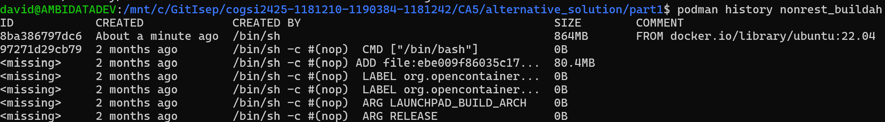

3. Alterou-se o ficheiro para seguir o conceito dos *multi-stage builds*:
   
   ```bash
   #!/bin/bash
   
   # Nome do container e das imagens
   container_name="nonrest_optimized"
   image_name="nonrest_optimized_buildah:1.0"
   
   # Imagem base para o estágio de construção (build)
   build_image="ubuntu:22.04"
   
   # Estágio 1: Construção da aplicação (compilar código, clonar repositório, etc.)
   buildah from --name ${container_name}-build $build_image
   
   # Atualizar lista de pacotes e instalar ferramentas necessárias
   buildah run ${container_name}-build apt-get update
   buildah run ${container_name}-build apt-get install -y openssh-client git openjdk-17-jdk curl
   
   # Criar o diretório .ssh para o usuário root e copiar a chave privada SSH
   buildah run ${container_name}-build mkdir -p /root/.ssh
   buildah copy ${container_name}-build ~/.ssh/id_ed25519 /root/.ssh/id_rsa
   
   # Criar o arquivo de configuração do SSH para o GitHub
   buildah run ${container_name}-build sh -c 'echo "Host github.com\n\tStrictHostKeyChecking no\n\tUserKnownHostsFile=/dev/null" > /root/.ssh/config'
   
   # Definir permissões corretas para os arquivos SSH
   buildah run ${container_name}-build chmod 700 /root/.ssh
   buildah run ${container_name}-build chmod 600 /root/.ssh/id_rsa
   buildah run ${container_name}-build chmod 600 /root/.ssh/config
   
   # Clonar o repositório
   repo_url="git@github.com:1181210/cogsi2425-1181210-1190384-1181242.git"
   clone_path="/root/cogsi"
   buildah run ${container_name}-build git clone $repo_url $clone_path
   
   # Definir diretório base para o projeto nonrest
   buildah config --workingdir /root/cogsi/CA2/tutRestGradle/nonrest $container_name
   
   # Remover o arquivo application.properties (não necessário para esta iteração)
   buildah run ${container_name}-build rm -rf /root/cogsi/CA2/tutRestGradle/nonrest/src/main/resources/application.properties
   
   # Executar o Gradle para gerar o JAR
   buildah run ${container_name}-build sh -c "cd /root/cogsi/CA2/tutRestGradle/nonrest && ../gradlew clean build"
   
   # Estágio 2: Imagem final (executar a aplicação)
   final_image="openjdk:17-jdk-slim"
   
   # Criar o container para o estágio final
   buildah from --name ${container_name}-final $final_image
   
   # Copiar o JAR gerado do estágio de construção para o estágio final
   buildah copy ${container_name}-final --from=${container_name}-build /root/cogsi/CA2/tutRestGradle/nonrest/build/libs/nonrest.jar /nonrest.jar
   
   # Definir o diretório de trabalho no estágio final
   buildah config --workingdir / ${container_name}-final
   
   # Expor a porta 8000 (para a documentação)
   buildah config --port 8000 ${container_name}-final
   
   # Configurar o comando de inicialização para o container gerado
   buildah config --cmd "java -jar /nonrest.jar" ${container_name}-final
   
   # Exportar a imagem final
   buildah commit ${container_name}-final $image_name
   
   # Tag para a versão mais recente
   buildah tag $image_name nonrest_optimized_buildah:latest
   
   # Limpeza dos containers temporários
   buildah rm ${container_name}-build
   buildah rm ${container_name}-final
   ```
   
   Este é muito semelhante ao já demonstrado na parte 1 com a utilização do *Docker*, criando-se uma imagem base para a fase de construção e outra imagem para executar a aplicação a partir de um novo *container* contendo apenas o conteúdo necessário para executar a aplicação.

4. Voltou-se a gerar a imagem otimizada e executou-se o comando de histórico do *podman* para verificar o tamanho final:
   
   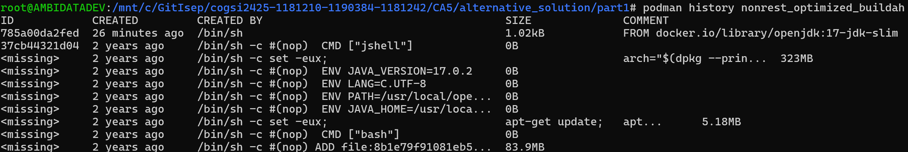
   
   A partir do comando acima é possível observar que o tamanho da imagem diminui consideravelmente.

##### Monitorização em tempo real dos Containers

Para monitorizar em tempo real os *containers* basta executar o seguinte comando:

```bash
podman stats
```

Este comando é "idêntico" ao *docker stats*. Em alternativa também se pode utilizar o seguinte comando:

```bash
podman top container-id-or-name
```

Este fornece algumas informações, tal como o consumo de recursos do *CPU*:

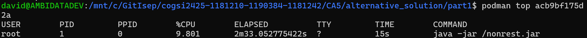

### Conclusão

A ferramenta ideal para a implementação da alternativa proposta seria o *podman* dado que permite a reutilização dos *Dockerfiles* para a criação das imagens, bem como possui o conceito do *podman-compose* que utiliza, tal como o *docker-compose*, ficheiros *yml* com a mesma sintaxe. Como a utilização desta ferramenta não corresponde a uma "verdadeira" alternativa ao *Docker*, tiveram de ser utilizadas três ferramentas que em conjunto permitiram alcançar a implementação da solução pretendida. O *buildah* para a geração das imagens, o *podman* para executar *containers* a partir das imagens e publicá-las no *Docker Hub* e o *Kubernetes* para a execução de múltiplos *containers* com os requisitos pedidos a partir de um único ficheiro de configuração.
