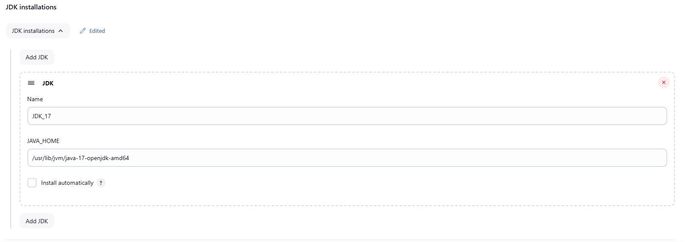
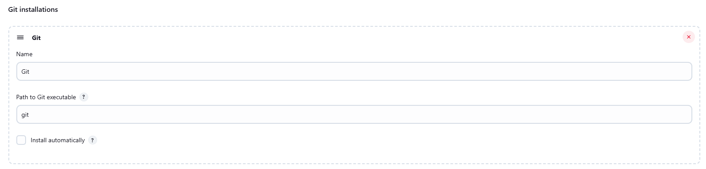
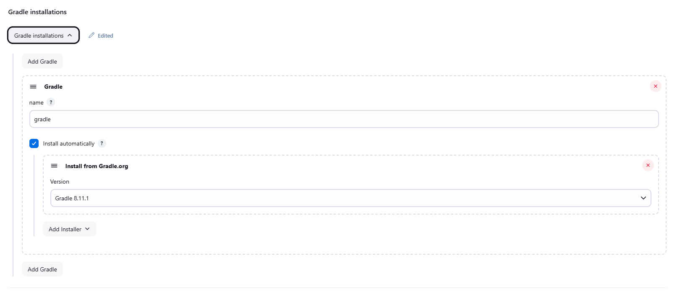
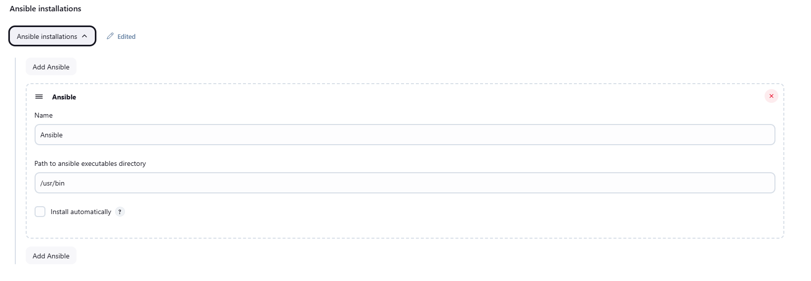
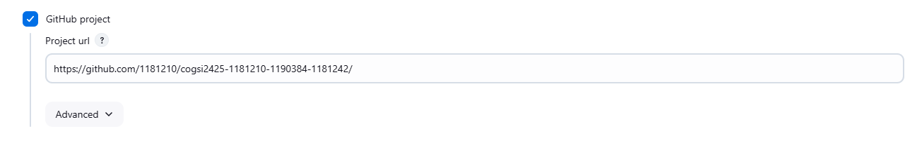
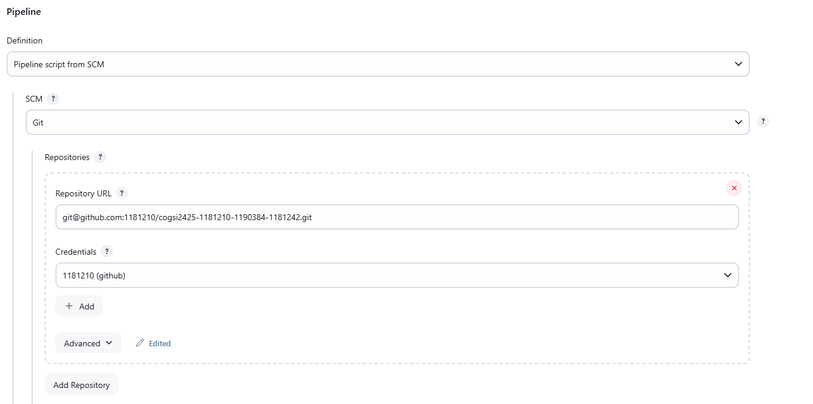
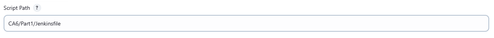
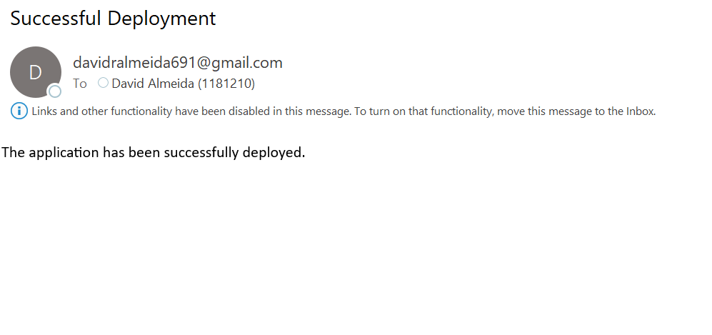
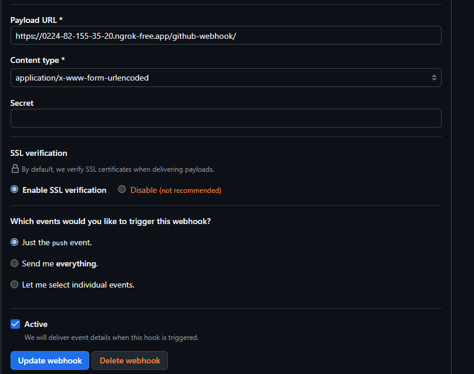

# CA6

## Instalação e Configuração do Jenkins

### Instalação do Jenkins no WSL

Para instalar o **Jenkins** no *WSL* começou-se por executar os seguintes comandos:

```bash
sudo wget -O /usr/share/keyrings/jenkins-keyring.asc \
    https://pkg.jenkins.io/debian-stable/jenkins.io-2023.key

echo "deb [signed-by=/usr/share/keyrings/jenkins-keyring.asc]" \
   https://pkg.jenkins.io/debian-stable binary/ | sudo tee \
   /etc/apt/sources.list.d/jenkins.list > /dev/null

 sudo apt-get update
 sudo apt-get install fontconfig openjdk-17-jre
 sudo apt-get install jenkins
```

Após a instalação verificou-se que o **Jenkins** foi corretamente instalado acedendo-se ao endereço: `http://localhost:8080/`.

### Configuração do Jenkins

De seguida, configuou-se a conta inicial do **Jenkins**, criando-se uma conta com privilégios de administrador. 

Posteriormente, ajustaram-se as *tools* necessárias para o presente trabalho:

1. Configurou-se o *JDK*:
   
   

2. Configurou-se o *GIT*:
   
   

3. Configurou-se o *Gradle*: 
   
   

4. Configurou-se o *Ansible*:
   
   

Por fim, instalaram-se os *Plugins* recomendados.

## Parte 1

### Versão 1

#### Criação das VMs utilizando o Vagrant

Para a criação das máquinas virtuais **blue** e **green** foi criado o seguinte ficheiro *vagrantfile*:

```shell
# -*- mode: ruby -*-
# vi: set ft=ruby :

# All Vagrant configuration is done below. The "2" in Vagrant.configure
# configures the configuration version (we support older styles for
# backwards compatibility). Please don't change it unless you know what
# you're doing.
Vagrant.configure("2") do |config|
  # The most common configuration options are documented and commented below.
  # For a complete reference, please see the online documentation at
  # https://docs.vagrantup.com.

  # Every Vagrant development environment requires a box. You can search for
  # boxes at https://vagrantcloud.com/search.

  config.vm.provider :virtualbox do |vb|
   vb.memory = "4096" # Aloca 4 GB de memória para a VM 
   vb.cpus = 2     # Aloca 2 CPUs para a VM
  end

  config.vm.boot_timeout = 600

  config.vm.box = "bento/ubuntu-22.04"

  # Copy public SSH key to VM
  config.vm.provision "file", source: "~/.ssh/id_ed25519.pub", destination: "~/.ssh/authorized_keys"

  config.ssh.forward_agent = true
  config.ssh.insert_key = false

  # Paths to the private key
  config.ssh.private_key_path = [
  "~/.vagrant.d/insecure_private_key",
  "~/.ssh/id_ed25519"
  ]


  # Copy all the available SSH keys locally into the Virtual Machine
  config.vm.provision "file", source: "~/.ssh/id_ed25519", destination: "/home/vagrant/.ssh/id_ed25519"
  config.vm.synced_folder "./shared/", "/shared"

  config.vm.hostname = "cogsiVagrant"

  config.vm.define "blue" do |blue|
    blue.vm.network "private_network", ip: "192.168.56.10"
    blue.vm.network "forwarded_port", guest: 22, host: 2223, id: "ssh_host1"
    blue.vm.network "forwarded_port", guest: 8080, host: 8081

    blue.vm.provision "file", source: "~/.ssh/id_ed25519", destination: "/home/vagrant/.ssh/id_ed25519"

    blue.vm.provision "ansible" do |ansible|
        ansible.compatibility_mode = "2.0"
        ansible.playbook = "./ansible/playbooks/provision_blue.yml"
        ansible.inventory_path = "./ansible/inventory/inventory.ini"
    end

  end

  config.vm.define "green" do |green|
    green.vm.network "private_network", ip: "192.168.56.11"
    green.vm.network "forwarded_port", guest: 22, host: 2224, id: "ssh_host2"
    green.vm.network "forwarded_port", guest: 8080, host: 8082

    green.vm.provision "file", source: "~/.ssh/id_ed25519", destination: "/home/vagrant/.ssh/id_ed25519"

    green.vm.provision "ansible" do |ansible|
      ansible.compatibility_mode = "2.0"
      ansible.playbook = "./ansible/playbooks/provision_green.yml"
      ansible.inventory_path = "./ansible/inventory/inventory.ini"
    end

  end

end
```

**Nota**: a sintaxe deste ficheiro não será explicada dado que já foi explicado no CA3.

Este ficheiro permite a criação e provisionamento das máquinas *blue* e *green*, utilizando-se *Playbooks* da ferramenta *Ansbile*.

Para a configuração e *Deploy* da versão atual da aplicação para a máquina *Blue* foi criado os seguintes *Playbook*:

```yml
---
- name: Atualiza a cache de pacotes
  apt:
    update_cache: yes

- name: Atualiza os pacotes
  apt:
    upgrade: dist
    force_apt_get: yes

- name: Instalar o JDK
  apt:
    name: openjdk-17-jdk
    state: present

- name: Instalar o GIT
  apt:
    name: git
    state: present

- name: Garantir que o diretório .ssh exista
  file:
    path: /home/vagrant/.ssh
    state: directory
    mode: '0700'
  become_user: vagrant
```

Este tem um conjunto de tarefas que são comuns à máquina *Green*, instalando-se os pacotes necessários e configurando o *ssh*.

```yml
---
- hosts: "blue"
  become: yes
  tasks:
    - import_tasks: install_and_configure_machine.yml

    - name: Adicionar GitHub aos hosts conhecidos
      known_hosts:
        path: /home/vagrant/.ssh/known_hosts
        name: github.com
        key: "{{ lookup('pipe', 'ssh-keyscan github.com') }}"
      become_user: vagrant

    - name: Criar o diretório de destino (se necessário)
      file:
        path: /cogsi_project
        state: directory
        owner: vagrant  
        group: vagrant  
        mode: '0770'
        recurse: true   

    - name: Garantir que a verificação de permissões de arquivos está desativada no Git
      git_config:
        name: core.fileMode
        value: false
        scope: global 
      become_user: vagrant

    - name: Clonar o repositório do serviço REST
      git:
        repo: "git@github.com:1181210/cogsi2425-1181210-1190384-1181242.git"
        dest: /cogsi_project
        version: main
        accept_hostkey: yes
        update: yes 
      become_user: vagrant

    - name: Ajustar permissões para o diretório cogsi_project
      file:
        path: /cogsi_project
        state: directory
        mode: '0770'
        owner: root
        recurse: true 

    - name: Copiar o serviço para o diretório do system
      template:
        src: "nonrest.service"
        dest: "/etc/systemd/system/nonrest.service"
        mode: 0755
      tags: install,systemd
      become: true      
      become_user: root  

    - name: Recarregar o systemd para reconhecer o serviço
      ansible.builtin.systemd:
        daemon_reload: true
      become: true       
      become_user: root  

    - name: Garantir que o serviço nonREST está ativo
      ansible.builtin.systemd:
        name: nonrest
        enabled: true
        state: started
      become: true      
      become_user: root
```

Este realiza o provisionamento da máquina *Blue* com a versão atual da aplicação, tendo-se criado o seguinte serviço para que a aplicação seja inicializada automaticamente no *boot* da máquina:

```bash
[Unit]
Description=Aplicação nonREST - Serviço
After=network.target

[Service]
Type=simple
User=root
WorkingDirectory=/cogsi_project/CA2/tutRestGradle/nonrest
ExecStart=/cogsi_project/CA2/tutRestGradle/gradlew bootRun
Restart=on-failure

[Install]
WantedBy=multi-user.target
```

Para além disso, foi criado um ficheiro de inventário de forma a permitir a conexão *ssh* do *Ansible* para as máquinas geradas a partir do *Vagrant* (**Blue** e **Green**):

```ini
[blue]
blue ansible_host=172.19.240.1 ansible_ssh_port=2223 ansible_ssh_user=vagrant ansible_ssh_private_key_file=~/.ssh/id_ed25519 ansible_ssh_common_args='-o StrictHostKeyChecking=no'

[green]
green ansible_host=172.19.240.1 ansible_ssh_port=2224 ansible_ssh_user=vagrant ansible_ssh_private_key_file=~/.ssh/id_ed25519 ansible_ssh_common_args='-o StrictHostKeyChecking=no'
```

Para a máquina *Green* foi criado o seguinte *Playbook*:

```yml
---
- hosts: "green"
  become: yes
  tasks:
    - import_tasks: install_and_configure_machine.yml
```

Este apenas instala os pacotes que serão necessários em passos posteriores deste trabalho.

#### Criação da Pipeline no Jenkins

De forma a criar a *pipeline* no *Jenkins* utilizou-se a interface do mesmo:

1. Acedeu-se à opção *New Item*;

2. Definiu-se o nome do *item* (**ca6-part1**) e escolheu-se o tipo pretendido (neste caso **Pipeline**);

Para a configuração da *Pipeline* criada foram definidos os seguintes passos:

1. Foi selecionada a opção *GitHub project* e inserido o *URL* do repositório pretendido
   
   

2. Na secção *General* definiu-se a *Pipeline* como *Pipeline script from SCM*, escolheu-se o *SCM Git* e definiu-se o *url* do repositório (neste caso para conexão *ssh*) e foram criadas as credenciais para o respetivo acesso:
   
   

3. Configurou-se os *Branches* pretendidos e definiu-se o caminho para o ficheiro *Jenkins* no repositório:
   
   

#### Configuração do Jenkinsfile

Inicialmente foi criado um *Jenkinsfile* com a seguinte estrutura:

```groovy
pipeline {
  agent any

  environment {
    ...
  }

  stages {
    ...
  }

  post {
      ...
  }
 }
```

De seguida serão detalhados os diferentes *stages* definidos no *Jenkinsfile*.

##### Checkout

Para realizar o *checkout* definiu-se o seguinte *stage*:

```groovy
stage('Checkout') {
  steps {
    checkout scm
  }
}
```

Este permite realizar o *checkout* utilizando o *scm* configurado anterirormente.

##### Assemble

Para realizar o *assemble* definiu-se o seguinte *stage*:

```groovy
  stage('Assemble') {
      steps {
        dir('CA2/tutRestGradle/nonrest') {
          sh 'rm -rf src/main/resources/application.properties'
          sh 'chmod +x ../gradlew'
          sh '../gradlew build'
        }
      }
    }
```

Este altera o diretório atual para a pasta *nonrest* do *CA2*, remove as *application.properties* (não sendo necessárias para o trabalho), altera as permissões do execução do *gradlew* e realiza a compilação e geração do ficheiro *jar*, utilizando-se o *gradlew build*.

##### Test

Para realizar o *test* definiu-se o seguinte *stage*:

```groovy
stage('Test') {
      steps {
        dir('CA2/tutRestGradle/nonrest') {
          sh '../gradlew test'
        }
      }

      post {
        always {
          dir('CA2/tutRestGradle/nonrest') {
            junit 'build/test-results/test/*.xml'
          }
        }

        success { 
          script { 
            def commitId = sh(script: 'git rev-parse HEAD', returnStdout: true).trim() 
            def version = sh(script: 'git tag --list | grep "stable-v" | sed "s/stable-v//" | sort -V | tail -n1', returnStdout: true).trim() 
            def nextVersion = version ? version.toInteger() + 1 : 1 
            def tagName = "stable-v${nextVersion}" 
            sh "git tag -a ${tagName} -m 'Build ${env.BUILD_ID} - ${commitId}'"
            sh "git push origin ${tagName}"
          }
        }

      }

    }
```

Neste define-se um *step* que compila os testes do projeto *nonrest*.

De seguida, define-se numa secção *post* (após os *steps*) a publicação do resultado dos testes no *Jenkins*, utilizando-se a ferramenta *junit*. Este está dentro de uma secção *always* de forma a garantir que este passo é sempre executado independentemente do resultado do *gradlew test*.

Por fim, na secção *success* (ou seja, caso os testes tenham sucesso), é realizada a publicação de uma *tag* no repositório. Para isto definiu-se um *script* que:

1. Começa por obter o *commit* a partir do qual a *pipeline* foi executada;

2. Obtém-se a última *tag* começada pela nomenclatura *stable-v*, utilizando-se o comando *git tag --list* em junção com o *grep* e, de seguida, obtém-se a versão/número dessa mesma *tag*;

3. Guarda-se numa variável o número da próxima versão a ser publicada;

4. Gera-se a tag e realiza-se o *push* da mesma utilizando-se o *Git*;

##### Archive

Para realizar o *archive* definiu-se o seguinte *stage*:

```groovy
 stage('Archive') {
      steps {
        dir('CA2/tutRestGradle/nonrest'){
          archiveArtifacts artifacts: 'build/libs/*.jar', fingerprint: true
        }
      }
    }
```

Neste define-se o diretório atual como sendo o *nonrest* do *CA2* (dado que a compilação foi gerada neste mesmo diretório) e, de seguida, utiliza-se o comando *archiveArtifacts* passando-se como parâmetro os *artifacts* pretendidos (neste caso os ficheiros *jar* gerados pelo *build* mencionado anteriormente).

##### Deploy to Production?

Para realizar o *Deploy to Production?* definiu-se o seguinte *stage*:

```groovy
stage('Deploy to Production?') {
      steps {
        input message: 'Deploy to production?', ok: 'Deploy'
      }
    }
```

Este força uma aprovação manual antes do *Deploy*, só procedendo para os próximos *stages* caso seja aprovado.

##### Deploy

Para realizar o *Deploy* definiu-se o seguinte *stage*:

```groovy
stage('Deploy to Production (Green)') {
      steps {
        dir('CA6/Part1') {
          ansiblePlaybook credentialsId: 'ansible'
        , disableHostKeyChecking: true
        , installation: 'Ansible'
        , playbook: "${ANSIBLE_PLAYBOOK_DEPLOY}"
        , inventory: "${ANSIBLE_INVENTORY}"
        , extraVars: [target: GREEN_VM, workspace: env.WORKSPACE]
        }
      }
    }
```

Para este *stage* começou-se por criar umas credenciais (*asible*) de forma a ser permitido o acesso *ssh* do mesmo.

Começa-se por definir o caminho para o diretório no qual os *playbooks* estão criados;

De seguida foi utilizado o *plugin* *ansibePlaybook* de forma a executar um *playbook* que realize o *deploy* para a máquina *green*:

1. **credentialsId:** identificador das credenciais criadas no *Jenkins*;

2. **installation:** nome da instalação do *Ansible* configurada no *Jenkins*;

3. **playbook:** o *Playbook* definido na variável;

4. **inventory:** o inventário definido na variável;

5. **extraVars**:  variáveis extra. Nesta caso passa-se a variável *target* com o valor *GREEN_VM* e a variável *workspace* com o *workspace* do *Jenkins*;

As variáveis mencionadas foram definidas na secção **enviorment** do **Jenkinsfile**:

```groovy
environment {
    GREEN_VM = 'green'
    ANSIBLE_INVENTORY = 'ansible/inventory/inventory_jenkins.ini'
    ANSIBLE_PLAYBOOK_DEPLOY = 'ansible/playbooks/deploy.yml'
    ANSIBLE_PLAYBOOK_ROLLBACK = 'ansible/playbooks/rollback.yml'
  }
```

O *playbook deploy.yml* criado tem o seguinte conteúdo:

```yml
---
- name: Deploy NonRest App
  hosts: "{{ target }}"
  become: yes
  vars:
    jenkins_url: "http://localhost:8080"

  tasks:
    - name: Check if service file exists
      stat:
        path: /etc/systemd/system/nonrest.service
      register: service_file

    - name: Stop existing application
      systemd:
        name: nonrest
        state: stopped
      ignore_errors: yes

    - name: Copy application jar
      copy:
        src: "{{ workspace }}/CA2/tutRestGradle/nonrest/build/libs/nonrest.jar"
        dest: "nonrest.jar"
        mode: '0755'

    - name: Create systemd service
      template:
        src: "{{ workspace }}/CA6/Part1/ansible/services/nonrestjar.j2"
        dest: /etc/systemd/system/nonrest.service
        mode: '0644'
      when: not service_file.stat.exists

    - name: Reload systemd daemon
      command: systemctl daemon-reload
      when: not service_file.stat.exists

    - name: Start application
      systemd:
        name: nonrest
        state: started
        daemon_reload: yesarted
        daemon_reload: yes
```

1. Este define os *hosts* que será executado (neste caso o *host green* passado na variável *target* do *Jenkinsfile*);

2. Verifica se o serviço *nonrest* já existe;

3. Pára a aplicação atual caso esteja a ser executada. O *ignore_errors* permite a continuação da execução das tarefas mesmo que o serviço não exista;

4. Copiar o *jar* gerado no *Jenkins* para a máquina;

5. Cria um serviço do *systemd* caso ainda não exista, copiando o ficheiro *nonrestjar.j2* no qual se define este mesmo serviço:
   
   ```bash
   [Unit]
   Description=NonRest APP
   After=network.target
   
   [Service]
   Type=simple
   User=vagrant
   Environment="JAVA_HOME=/usr/lib/jvm/java-17-openjdk-amd64"
   WorkingDirectory=/home/vagrant/
   ExecStart=/usr/bin/java -jar /home/vagrant/nonrest.jar
   SuccessExitStatus=143
   TimeoutStopSec=10
   Restart=on-failure
   RestartSec=5
   
   [Install]
   WantedBy=multi-user.target
   ```

6. Reinicia o *systemd* para que as alterações sejam aplicadas caso o serviço seja novo;

7. Inicializa o serviço *nonrest* que executa a aplicação, garantindo-se que são utilizadas as últimas configurações (*daemon_reload:yes*);

##### Post-Actions

Foram definidas duas *post-actions* na *pipeline*:

```groovy
post {

    always {
      echo "Pipeline execution completed with status: ${currentBuild.result}"
    }

    success {
      script {
        def retries = 5
        def waitTime = 10

        for (int i = 0; i < retries; i++) {
          def status = sh(script: 'curl -s -o /dev/null -w "%{http_code}" http://192.168.56.11:8080/employees || echo "000"', returnStdout: true).trim()

          if (status == "200") {
            echo "The app is functioning correctly! Status: ${status}"
            break
          } else {
            echo "The app is not started yet. Status: ${status}. Try number ${i + 1} of ${retries}"

            if (i == retries - 1) {
              error("The verification of the deployment failed after ${retries} tries.")
            }

          sleep(waitTime)
        }
      }


    }
  }
 }
```

1. **Notificação:** na secção *always* define-se um *print* de uma mensagem com o resultado da execução da *pipeline* através da variável *currentBuild.result*;

2. **Verificação do Deploy**: após a execução bem-sucedida dos *stages* anteriores, é realizado um *healthcheck* para garantir que a aplicação *nonrest* está funcional. Este processo consiste num ciclo de cinco tentativas, com intervalos de dez seguindos entre elas. Durante cada tentativa, é enviado um pedido *Get* ao *endpoint* **http://192.168.56.11:8080/employees** (correspondente à máquina *green*). O sucesso do *deploy* é confirmado se o *status_code* retornado for 200;

##### Rollback

Para a criação do *rollback* foi adicionado um *stage* ao *Jenkinsfile* permitindo o utilizador escolher se quer ou não realizar um *rollback* (foi necessário assumir um cenário fictício):

```groovy
    stage('Rollback') {

      steps {
        script {

          def performRollback = input(
                message: 'Rollback to a stable version?',
                ok: 'Proceed',
                parameters: [
                    booleanParam(
                        defaultValue: false,
                        description: 'Check to perform rollback',
                        name: 'ROLLBACK'
                    )
                  ]
          )

          if (performRollback) {

            withCredentials([usernamePassword(credentialsId: 'jenkins-api-credentials', usernameVariable: 'JENKINS_USER', passwordVariable: 'JENKINS_API_TOKEN')]) {
              dir('CA6/Part1') {
                ansiblePlaybook credentialsId: 'ansible', 
                                disableHostKeyChecking: true, 
                                installation: 'Ansible', 
                                playbook: "${ANSIBLE_PLAYBOOK_ROLLBACK}", 
                                inventory: "${ANSIBLE_INVENTORY}",
                                extraVars: [
                                  jenkins_url: "${env.JENKINS_URL}",
                                  jenkins_user: "${env.JENKINS_USER}",
                                  jenkins_api_token: "${env.JENKINS_API_TOKEN}",
                                  jenkins_job: "ca6-part1"
                                ]
              }
            }
          }
          else {
            echo "Rollback was cancelled"
          }

        }
      }


    }
```

Este começa por perguntar ao utilizador se o mesmo pretende realizar um *rollback* e caso este pretenda é executado um *playbook* criado para este efeito. De forma a garantir a segurança são passadas as variáveis de acesso ao *Jenkins* (que serão necessárias para descarregar os artefactos das *builds* bem sucedidas) para o *playbook*. 

O *playbook* criado para a realização do *rollback* tem o seguinte conteúdo:

```yml
---
- name: Rollback nonRest APP
  hosts: green
  become: yes
  vars:
    artifact_name: "nonrest.jar"
    health_url: "http://127.0.0.1:8080/employees"

  tasks:
    - name: Stop current NonRest Service
      service:
        name: nonrest
        state: stopped

    - name: Get the artifact from jenkins
      get_url:
        url: "http://172.19.240.120:8080/job/{{ jenkins_job }}/lastSuccessfulBuild/artifact/build/libs/{{ artifact_name }}"
        dest: "{{ artifact_name }}"
        url_username: "{{ jenkins_user }}"
        url_password: "{{ jenkins_api_token }}"
        force_basic_auth: yes

    - name: Start the service
      service:
        name: nonrest 
        state: started

    - name: Check if nonrest app is working properly
      uri:
        url: "{{ health_url }}"
        method: GET
        status_code: 200 
      register: health_check
      until: health_check.status == 200
      retries: 6
      delay: 10

    - name: Force failure if healthchecks fail 
      fail:
        msg: "Healthcheck failed after rollback."
      when: health_check.status != 200

    - name: Check success of the rollback
      debug:
        msg: "Rollback carried out successfully and the application is working!"
```

Neste são definidas as seguintes tarefas:

1. Pára o serviço atual que está a ser executado (de forma a evitar conflitos ao substituir o artefacto);

2. Descarrega o artefacto estável mais recente a partir da *pipeline* do *Jenkins*, utilizando as credencias passadas por parâmetro a partir do *Jenkinsfile*. Para além disso, substitui o artefacto atual pelo artefacto descarregado;

3. Reincia o serviço para que as alterações sejam aplicadas;

4. Realiza um *healthcheck* com um comportamento semelhante ao mencionado anteriormente no *Jenkinsfile* de forma a validar se a aplicação está a ser executada corretamente;

5. Caso o *healthcheck* falhe o *playbook* é interrompido;

6. Mostra uma mensagem de sucesso caso o *rollback* tenha funcionado corretamente;

### Versão 2

Começou-se por criar um *vagrantfile* responsável por criar a máquina *prod* com o seguinte conteúdo:

```bash
# -*- mode: ruby -*-
# vi: set ft=ruby :

# All Vagrant configuration is done below. The "2" in Vagrant.configure
# configures the configuration version (we support older styles for
# backwards compatibility). Please don't change it unless you know what
# you're doing.
Vagrant.configure("2") do |config|
  # The most common configuration options are documented and commented below.
  # For a complete reference, please see the online documentation at
  # https://docs.vagrantup.com.

  # Every Vagrant development environment requires a box. You can search for
  # boxes at https://vagrantcloud.com/search.
  
  config.vm.provider :virtualbox do |vb|
   vb.memory = "4096" # Aloca 4 GB de memória para a VM 
   vb.cpus = 2     # Aloca 2 CPUs para a VM
  end

  config.vm.boot_timeout = 600
  
  config.vm.box = "bento/ubuntu-22.04"

  # Copy public SSH key to VM
  config.vm.provision "file", source: "~/.ssh/id_ed25519.pub", destination: "~/.ssh/authorized_keys"
  
  config.ssh.forward_agent = true
  config.ssh.insert_key = false
  
  # Paths to the private key
  config.ssh.private_key_path = [
  "~/.vagrant.d/insecure_private_key",
  "~/.ssh/id_ed25519"
  ]

  
  # Copy all the available SSH keys locally into the Virtual Machine
  config.vm.provision "file", source: "~/.ssh/id_ed25519", destination: "/home/vagrant/.ssh/id_ed25519"
  config.vm.synced_folder "./shared/", "/shared"

  config.vm.hostname = "cogsiVagrant"

  config.vm.define "prod" do |prod|
    prod.vm.network "private_network", ip: "192.168.56.12"
    prod.vm.network "forwarded_port", guest: 22, host: 2225, id: "ssh_host3"
    prod.vm.network "forwarded_port", guest: 8080, host: 8083
    
    prod.vm.provision "file", source: "~/.ssh/id_ed25519", destination: "/home/vagrant/.ssh/id_ed25519"

    prod.vm.provision "ansible" do |ansible|
        ansible.compatibility_mode = "2.0"
        ansible.playbook = "./ansible/playbooks/deployment.yml"
        ansible.inventory_path = "./ansible/inventory/inventory.ini"
    end
   
  end

end

```

Este é semelhante ao já explicado na parte 1, mas para a máquina *Prod*.

#### Criação e Configuração da Pipeline no Jenkins

De seguida, criou-se uma *Pipeline* no *Jenkins* seguindo um processo semelhante ao já demonstrado na parte 1 e instalou-se o *plugin* do *Docker*.

Posteriormente, acedeu-se às configurações do *Jenkins* (*Manage Jenkins*), criando-se dois *nodes*:

1. Acedeu-se ao *item* *nodes*;

2. Escolheu-se a opção *New Node*;

3. Definiu-se o nome do *node* (neste caso *unit-test-node*);

4. Configurou-se o *node* definindo-se o *Number of exectutors* como `2`, o *remote root directory* como `/var/lib/jenkins`, a *label* como `unit-test-node`;

De seguida, este processo foi repetido para a criação do *node* `integration-test-node`;

Por fim, executaram-se ambos os *nodes* criados em *background* recorrendo-se ao seguinte comando:

```
 nohup java -jar agent.jar -url http://localhost:8080/ -secret f82d7ba6c8bed22e182c05e003d6ba1491e32ee69fee23e8a4f5483a1cb022ea -name "unit-test-node" -webSocket -workDir "/var/lib/jenkins" &
```

Estes serão utilizados para executar os testes em paralelo posteriormente.

#### Configuração do Jenkinsfile

De seguida serão detalhados os diferentes *stages* definidos no *Jenkinsfile*.

##### Checkout

Para realizar o *checkout* definiu-se o seguinte *stage*:

```groovy
stage('Checkout') {
  steps {
    checkout scm
  }
}
```

Este permite realizar o *checkout* utilizando o *scm* configurado anterirormente.

##### Assemble

Para realizar o *assemble* definiu-se o seguinte *stage*:

```groovy
stage('Assemble') {
      steps {
        dir('CA2/tutRestGradle/nonrest') {
          sh 'rm -rf src/main/resources/application.properties'
          sh 'chmod +x ../gradlew'
          sh '../gradlew build'
        }
      }
    }
```

#### Test

Para realizar o *test* definiu-se o seguinte *stage*:

```groovy
 stage('Test') {
      parallel {
        stage('Unit Tests') {
          agent { label 'unit-test-node' }
          steps {
            dir('CA2/tutRestGradle/nonrest') {
              sh 'rm -rf src/main/resources/application.properties'
              sh '../gradlew test'
            }

            post{
              always {
                dir('CA2/tutRestGradle/nonrest') {
                  sh 'ls -l build/test-results/test'
                  junit '**/build/test-results/test/TEST-*.xml'
                }
              }
            }
          
          }
        }
      
        stage('Integration Tests') {
          agent { label 'integration-test-node' }
          steps {
            dir('CA2/tutRestGradle/nonrest') {
              sh 'rm -rf src/main/resources/application.properties'
              sh '''echo "server.port=9090" > src/main/resources/application.properties'''
              sh '../gradlew integrationTest'
            }
          }

          post{
            always {
              dir('CA2/tutRestGradle/nonrest') {
                junit '**/build/test-results/integrationTest/*.xml'
              }
            }
          }
        }
      }
    }
```

1. Neste define-se o *parallel* de forma a executar os dois *stages* em paralelo;

2. Define-se para cada um dos *stages* o *node* respetivo (criado anteriormente);

3. Executa-se os testes recorrendo-se ao *gradle* (unitários e de integração);

4. Por fim, em cada um destes *stages* define-se uma secção *post* que publicao resultado de ambos os testes no *Jenkins*;

Em ambos os *stages* é utilizado o comando *dir* para a mudança para o diretório necessário.

##### Tag Docker Image

Para realizar o *tag docker image* definiu-se o seguinte *stage*:

```groovy
   stage('Tag Docker Image') {
      steps {
        script {
          sh 'cp CA2/tutRestGradle/nonrest/build/libs/nonrest.jar CA6/Part2/'
          dir('CA6/Part2') {
            dockerImage = docker.build("david691691/nonrest:${env.BUILD_NUMBER}")
            dockerImage.tag("latest")
          }
        }
      }
    }
```

Para este *stage* foi criado o seguinte *dockerfile*:

```dockerfile
FROM openjdk:17-jdk-slim


# Copiar apenas o jar da imagem de build
COPY ./nonrest.jar /nonrest/nonrest.jar

# Definir o diretório de trabalho
WORKDIR /nonrest

# Expor a porta da aplicação
EXPOSE 8000

# Comando para iniciar a aplicação
CMD ["java", "-jar", "nonrest.jar"]

```

Este copia o *jar* para o diretório *nonrest* e permite a sua execução no arranque do *container*.

De forma a facilitar este processo foi copiado o *jar* gerado anteriormente (no diretório CA2) para o diretório atual.

Este *Dockerfile* é executado recorrendo-se ao *plugin* do *Docker* e são criadas duas *tags* (a *latest*) e outra com o número da *build* atual.

##### Archive

Para realizar o *archive* definiu-se o seguinte *stage*:

```groovy
 stage('Archive') {
      steps {
        archiveArtifacts artifacts: '**/Dockerfile', fingerprint: true
      }
    }
```

Este realiza o *archive* do *Dockerfile* mencionado.

##### Push Docker Image

Para realizar o *push docker image* definiu-se o seguinte *stage*:

```groovy
stage('Push Docker Image') {
      steps {
        script {
          docker.withRegistry('https://registry.hub.docker.com', 'docker-credentials-token') {  
            dockerImage.push()    
            dockerImage.push('latest')
          }
        }
      }
    }
```

Para a realização deste *stage* começou-se por definir as credenciais do *Docker* no *Jenkins*.

De seguida utiliza-se novamente o *Plugin* do *Docker* e as credenciais criadas para realizar a publicação da imagem no *Dockerhub*.

##### Deploy

Para realizar o *deploy* definiu-se o seguinte *stage*:

```groovy
stage('Deploy') {
      when {
          expression { return env.GIT_BRANCH == 'origin/main' }
      }
            
      steps {
        withCredentials([usernamePassword(credentialsId: 'docker-credentials-token', usernameVariable: 'DOCKER_USER', passwordVariable: 'DOCKER_PASSWORD')]) {
          dir('CA6/Part2') {
            ansiblePlaybook credentialsId: 'ansible',
              installation: 'Ansible',
              playbook: "${ANSIBLE_PLAYBOOK_DEPLOY}",
              inventory: "${ANSIBLE_INVENTORY}",
              extraVars: [
                docker_user: "${DOCKER_USER}",
                docker_password: "${DOCKER_PASSWORD}",
                docker_image: "david691691/nonrest:${env.BUILD_NUMBER}"
              ]
          } 
        }
      }
    }
```

Neste *stage* começa-se por definir uma secção *when* que faz com que este apenas seja executado caso o *branch* atual seja o *main*.

De seguida, criou-se o seguinte *playbook*:

```yml
---
- name: Deploy NonRest App
  hosts: prod
  become: yes
  tasks:

    - name: Ensure Docker is installed
      apt:
        name: docker.io
        state: present

    - name: Login to Docker Hub
      shell: docker login -u "{{ docker_user }}" -p "{{ docker_password }}"
      become: yes

    - name: Stop and remove old container if exists
      docker_container:
        name: nonrest
        state: absent
      become: yes

    - name: Pull the latest Docker image
      docker_image:
        name: "{{ docker_image }}"
        source: pull
      become: yes
      register: docker_pull_result
      failed_when: docker_pull_result.failed


    - name: Run the new Docker container
      docker_container:
        name: nonrest
        image: "{{ docker_image }}"
        ports:
         - "8000:8080"
        state: started
      become: yes
      register: docker_run_result
      failed_when: docker_run_result.failed


```

1. Começa-se por garantir que o *Docker* esteja instalado;

2. Realiza-se a autenticação no *DockerHub*;

3. Para-se e remove-se o *container* atual, recorrendo-se ao *plugin* do *docker_container*;

4. Realiza-se o *Pull* da última imagem, recorrendo-se ao *plugin* do *docker_image*;

5. Executa-se o *container* recorrendo-se ao *plugin* do *docker_container* mapeando-se o porto 8080 do *prod* para o porto 8000 do *host*;

No *Jenkinsfile* passa-se as variáveis necessárias para a autenticação no *Dockerhub*, bem como o nome da última imagem (poderia também ter sido utilizado o *latest*).

##### Post-Actions

Foi definida a seguinte secção de *post-actions*:

```groovy
post {
    success {

      script {
        def retries = 5
        def waitTime = 10

        for (int i = 0; i < retries; i++) {
          def status = sh(script: 'curl -s -o /dev/null -w "%{http_code}" http://192.168.56.12:8000/employees || echo "000"', returnStdout: true).trim()
        
          if (status == "200") {
            echo "The app is functioning correctly! Status: ${status}"
            break
          } else {
            echo "The app is not started yet. Status: ${status}. Try number ${i + 1} of ${retries}"
            
            if (i == retries - 1) {
              error("The verification of the deployment failed after ${retries} tries.")
            }
          
            sleep(waitTime)
          }
        }
      }

      mail to: '1181210@isep.ipp.pt',
      subject: "Successful Deployment",
      body: "The application has been successfully deployed."
    }
    
    failure {
      mail to: '1181210@isep.ipp.pt',
      subject: "Deployment Failed",
      body: "The deployment process failed. Please check Jenkins logs."
    }

    unstable {
      mail to: '1181210@isep.ipp.pt',
      subject: "Deployment Unstable",
      body: "The deployment process was unstable. Please check Jenkins logs."
    }

  }
```

1. No caso de sucesso utiliza-se um *healthcheck* (semelhante ao utilizado na parte 1) de forma a garantir que a aplicação está a ser executada corretamente;

2. Envia-se uma notificação (através de email) com o resultado da *pipeline* (*failure*, *success* e *unstable*). Para a configuração do envio dos emails foi necessário alterar uma configuração no *Jenkins*, configurando-se o *smtp*, o porto a utilizar e o email de origem. Foi obtido sucesso na operação:
   
   

#### Configuração do WebHook

Começou-se por instalar o *ngrok* no *wsl* e executou-se o mesmo de forma a obter um endereço "público". Depois de instalado foi executado o seguinte comando de forma a obter este mesmo endereço:

```bash
ngrok http 8080
```

De seguida, acedeu-se às definições do repositório no *Github* e adicionou-se o *webhook* com o endereço exposto anteriormente:



Por fim, alterou-se a *pipeline* no *jenkins* ativando-se a opção *GitHub hook trigger for GITScm polling* para que as *builds* sejam executadas automaticamente no *push*.

## Solução alternativa ao Jenkins

Nesta secção é detalhada uma solução alternativa ao Jenkins, utilizando o **GitLab CI/CD**. Esta ferramenta moderna oferece uma abordagem integrada e eficiente para pipelines de CI/CD, eliminando a necessidade de um servidor Jenkins separado. Com suporte nativo ao GitLab, garante maior simplicidade, flexibilidade e escalabilidade para automatização de builds, testes e deploys.

---

### Introdução ao GitLab CI/CD

O GitLab CI/CD é uma solução integrada no GitLab que permite configurar pipelines diretamente no repositório de código. No fundo automatiza tarefas como compilação, execução de testes e deploys, oferecendo suporte completo a estratégias avançadas de CI/CD.

---

### Como é que o GitLab CI/CD funciona?

No GitLab CI/CD, os pipelines são definidos num ficheiro `.gitlab-ci.yml`, que contém as etapas e jobs necessários. Sempre que um commit é enviado ao repositório, o GitLab verifica as regras definidas no ficheiro e executa os jobs correspondentes em runners configurados. Estes runners podem ser locais, partilhados ou configurados em ambientes específicos.

Os principais componentes do GitLab CI/CD incluem:

1. **Runners**: Máquinas responsáveis por executar os jobs.
2. **Stages**: Representam fases do pipeline, como build, test ou deploy.
3. **Jobs**: Tarefas específicas que são executadas em cada stage.
4. **Artefatos**: Ficheiros gerados pelos jobs, como binários ou relatórios.
5. **Ambientes**: Destinos onde as aplicações são implantadas, como staging ou produção.

---

### Processo de execução do GitLab CI/CD

O fluxo de execução no **GitLab CI/CD** segue etapas claras, semelhantes a outros sistemas de CI/CD, mas com a vantagem de estar totalmente integrado no GitLab. As etapas incluem desde a criação do ficheiro de configuração até a execução dos jobs de build, testes e deploy.

1. **Criação do ficheiro `.gitlab-ci.yml`**:
   
   - Para cada projeto, criamos um ficheiro `.gitlab-ci.yml` que define as etapas e jobs do pipeline. Este ficheiro é essencial para descrever o que deve ser feito em cada estágio do ciclo de vida do CI/CD, como **build**, **test** e **deploy**.

2. **Execução do Pipeline**:
   
   - O GitLab automaticamente executa o pipeline sempre que há um novo commit no repositório. Ele lê o ficheiro `.gitlab-ci.yml` e executa os jobs definidos nas respectivas fases (Stages).
   - Os **jobs** são executados de forma **sequencial** ou **paralela**, dependendo da configuração. A execução ocorre no **runner** configurado, seja ele local ou partilhado.

3. **Execução de Jobs no Runner**:
   
   - O GitLab Runner executa os jobs conforme definidos no ficheiro `.gitlab-ci.yml`. Os runners podem ser configurados para executar os jobs em containers Docker, máquinas virtuais ou no sistema local.
   
   - O runner verifica o ficheiro `.gitlab-ci.yml` e executa as tarefas de build, test ou deploy de acordo com as definições.
     
     Para garantir que os jobs sejam executados corretamente, é necessário que o runner esteja configurado para a execução do tipo de job desejado, como Docker ou shell.

4. **Monitorização e Feedback**:
   
   - Após a execução do pipeline, o GitLab fornece **feedback** imediato sobre o status de cada job. É possível visualizar se os jobs foram **bem-sucedidos** ou **falharam**.
   - O GitLab também permite visualizar **logs** detalhados de cada job, possibilitando diagnósticos rápidos de erros ou falhas durante a execução.

5. **Deploy e Produção**:
   
   - O último estágio geralmente envolve o **deploy** da aplicação. Com o GitLab CI/CD, o deploy pode ser automatizado para ambientes de staging ou produção.
   - O GitLab pode executar comandos de deploy diretamente ou integrar-se com ferramentas externas, como Ansible, Kubernetes ou Docker, para realizar o deploy da aplicação nos ambientes de destino.

---

### Vantagens do GitLab CI/CD

1. **Integração Nativa**:
   
   - O GitLab CI/CD é totalmente integrado ao GitLab, o que elimina a necessidade de configurar ferramentas externas, como servidores Jenkins ou integração via webhooks. Isso proporciona uma configuração mais rápida e simples.

2. **Facilidade de Uso**:
   
   - O GitLab CI/CD usa um ficheiro `.gitlab-ci.yml`, que pode ser versionado juntamente com o código-fonte. Isso torna a configuração do pipeline intuitiva e centralizada no repositório, facilitando a manutenção e a colaboração entre os membros da equipa.

3. **Execução Paralela**:
   
   - O GitLab permite que múltiplos jobs sejam executados em paralelo, o que pode reduzir significativamente o tempo total de execução do pipeline, especialmente em grandes projetos com muitos testes.

4. **Flexibilidade de Runners**:
   
   - Podemos usar runners partilhados (disponíveis no GitLab) ou personalizar os próprios runners. Isso dá flexibilidade para escolher entre usar runners baseados em nuvem ou executar runners no próprio ambiente local.

5. **Ambientes e Monitorização**:
   
   - O GitLab CI/CD permite a gestão de diferentes ambientes (staging, produção) e inclui recursos integrados de monitorização e alertas, o que facilita a gestão e análise do pipeline.

6. **Suporte a Docker e Kubernetes**:
   
   - O GitLab CI/CD oferece suporte completo para integração com Docker e Kubernetes, o que facilita a gestão de containers e planeamento de aplicações em ambientes distribuídos.

7. **Comunidade e Suporte**:
   
   - O GitLab tem uma grande comunidade de desenvolvedores e uma vasta documentação, o que facilita a resolução de problemas e a implementação de novas funcionalidades.

---

### Comparação com Outras Alternativas

| **Fator de Comparação**       | **Jenkins**                            | **GitLab CI/CD**                | **CircleCI**                       | **GitHub Actions**               |
| ----------------------------- | -------------------------------------- | ------------------------------- | ---------------------------------- | -------------------------------- |
| **Integração com Git**        | Requer configuração de webhooks        | Nativo no GitLab                | Requer configuração                | Nativo no GitHub                 |
| **Configuração**              | Complexa, baseada em plugins           | Simples via `.gitlab-ci.yml`    | Moderada, baseada em YAML          | Simples via `.github/workflows/` |
| **Execução Paralela**         | Sim, mas depende de configuração extra | Sim, suporte nativo             | Sim, suporte nativo                | Sim, suporte nativo              |
| **Runners/Executores**        | Configuração manual                    | Integrado ou configurável       | Cloud-based                        | Cloud-based                      |
| **Interface de Uso**          | Mais técnica                           | Intuitiva                       | Intuitiva                          | Intuitiva                        |
| **Custo**                     | Gratuito, mas com custos operacionais  | Gratuito para projetos públicos | Pago, baseado em tempo de execução | Gratuito para projetos públicos  |
| **Comunidade e Documentação** | Extensa                                | Ampla                           | Boa                                | Ampla                            |

O **GitLab CI/CD** destaca-se pela simplicidade de configuração e integração direta com o GitLab, sendo uma alternativa robusta e eficiente ao Jenkins para projetos que já utilizam esta plataforma. Comparado ao **CircleCI** e **GitHub Actions**, o GitLab oferece maior flexibilidade de configuração e escalabilidade, com o benefício adicional de ser uma solução totalmente integrada para todos os aspectos de desenvolvimento e entrega contínua.

---

### Considerações Finais

O **GitLab CI/CD** é uma ferramenta poderosa e flexível que oferece uma solução integrada para a automatização de pipelines de CI/CD. A sua simplicidade de configuração, combinada com a forte integração com o GitLab, torna-o ideal para equipas que procuram uma solução eficiente e sem a complexidade de ferramentas externas. A capacidade de executar jobs em paralelo, o suporte para ambientes personalizados e a integração com Docker e Kubernetes tornam o GitLab uma escolha sólida para projetos de pequeno, médio e grande porte.
